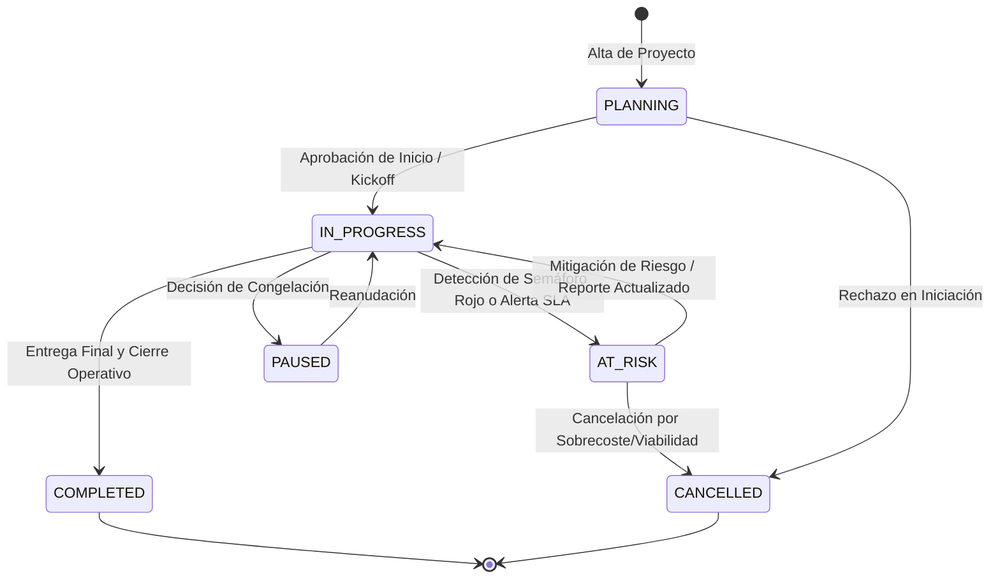
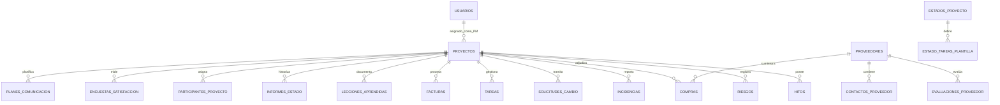

# 📊 DOCUMENTO MAESTRO DE ESPECIFICACIÓN FUNCIONAL Y TÉCNICA (MANUAL COMPLETO DE REPLICACIÓN)
## Plataforma PMO Control Tower (Versión 3.0 Enterprise)

> **Nota de Especificación:** Este documento constituye el plano maestro de arquitectura (*blueprint*), especificación funcional, modelo de datos y diseño técnico integral de la plataforma **PMO Control Tower**. Está redactado con nivel de detalle exhaustivo para permitir la reconstrucción, migración o desarrollo completo de la aplicación en cualquier motor de Inteligencia Artificial o stack tecnológico sin pérdida de información ni requisitos de negocio.

---

## 📑 ÍNDICE DE CONTENIDOS

- [1. Ficha del Proyecto, Alcance y Matriz de Objetivos de Negocio](#1-ficha-del-proyecto-alcance-y-matriz-de-objetivos-de-negocio)
  - [1.1. Contexto Corporativo y Problemas a Resolver](#11-contexto-corporativo-y-problemas-a-resolver)
  - [1.2. Objetivos de Negocio y Metas OKR de la PMO](#12-objetivos-de-negocio-y-metas-okr-de-la-pmo)
- [2. Arquitectura de Dominio, Modalidades de Iniciativa y Ciclo de Vida](#2-arquitectura-de-dominio-modalidades-de-iniciativa-y-ciclo-de-vida)
  - [2.1. Estructura Jerárquica de Dominio (Portafolios, Sedes y Proyectos)](#21-estructura-jerárquica-de-dominio-portafolios-sedes-y-proyectos)
  - [2.2. Modalidades de Proyecto: Estándar vs. Iniciativa Ligera](#22-modalidades-de-proyecto-estándar-vs-iniciativa-ligera)
  - [2.3. Máquina de Estados del Ciclo de Vida y Reglas de Transición](#23-máquina-de-estados-del-ciclo-de-vida-y-reglas-de-transición)
- [3. Especificación Funcional Módulo por Módulo (Las 12 Pantallas UI)](#3-especificación-funcional-módulo-por-módulo-las-12-pantallas-ui)
  - [3.1. Dashboard Ejecutivo y Análisis del Portafolio](#31-dashboard-ejecutivo-y-análisis-del-portafolio)
  - [3.2. Dashboard de Portafolio y Métricas Financieras](#32-dashboard-de-portafolio-y-métricas-financieras)
  - [3.3. Dashboard Operativo de Proyectos para PMs](#33-dashboard-operativo-de-proyectos-para-pms)
  - [3.4. Ficha 360° del Proyecto (ProjectDetail.jsx y sus 7 Pestañas)](#34-ficha-360-del-proyecto-projectdetailjsx-y-sus-7-pestañas)
  - [3.5. Cuadro de Gobernanza y Auditoría de SLAs (GovernanceDashboard.jsx)](#35-cuadro-de-gobernanza-y-auditoría-de-slas-governancedashboardjsx)
  - [3.6. Módulo PIPs (Planes de Mejora de la Planta / Control Presupuestario)](#36-módulo-pips-planes-de-mejora-de-la-planta--control-presupuestario)
  - [3.7. Directorio de Proveedores y Ficha Vendor 360° (Vendor360.jsx)](#37-directorio-de-proveedores-y-ficha-vendor-360-vendor360jsx)
  - [3.8. Banco Global de Lecciones Aprendidas (GeneralLessonsPage.jsx)](#38-banco-global-de-lecciones-aprendidas-generallessonspagejsx)
  - [3.9. Roadmap Multi-proyecto e Histórico Timeline (Timeline.jsx)](#39-roadmap-multi-proyecto-e-histórico-timeline-timelinejsx)
  - [3.10. Motor de Encuestas de Satisfacción y Planes de Comunicación](#310-motor-de-encuestas-de-satisfacción-y-planes-de-comunicación)
  - [3.11. Generador de Reportes Ejecutivos e Impresión (PortfolioReport.jsx)](#311-generador-de-reportes-ejecutivos-e-impresión-portfolioreportjsx)
  - [3.12. Panel de Administración, Configuración y Maestros (AdminPanel.jsx)](#312-panel-de-administración-configuración-y-maestros-adminpaneljsx)
- [4. Diccionario de Datos Completo (Especificación de las 30 Tablas BD)](#4-diccionario-de-datos-completo-especificación-de-las-30-tablas-bd)
  - [4.1. Catálogos y Entidades Maestras (Sedes, Departamentos, Tipos, etc.)](#41-catálogos-y-entidades-maestras-sedes-departamentos-tipos-etc)
  - [4.2. Entidades Principales (Usuarios, Proveedores, Portafolios, Proyectos)](#42-entidades-principales-usuarios-proveedores-portafolios-proyectos)
  - [4.3. Entidades de Operación y Seguimiento 360° (Hitos, Riesgos, CRs, Facturas, etc.)](#43-entidades-de-operación-y-seguimiento-360-hitos-riesgos-crs-facturas-etc)
- [5. Algoritmos, Reglas de Negocio y Fórmulas Calculadas](#5-algoritmos-reglas-de-negocio-y-fórmulas-calculadas)
  - [5.1. Matriz de Severidad de Riesgos ($P \times I$)](#51-matriz-de-severidad-de-riesgos-p-times-i)
  - [5.2. Salud del Proyecto (Traffic Light RAG)](#52-salud-del-proyecto-traffic-light-rag)
  - [5.3. SLAs de Gobernanza y Auditoría (14/30 Días)](#53-slas-de-gobernanza-y-auditoría-1430-días)
  - [5.4. Índice de Salud Metodológica (Health Score %)](#54-índice-de-salud-metodológica-health-score-)
  - [5.5. Transacción ACID de Aprobación de Change Request (CR)](#55-transacción-acid-de-aprobación-de-change-request-cr)
  - [5.6. Rating de Evaluación Vendor 360°](#56-rating-de-evaluación-vendor-360)
- [6. Especificación Completa de Endpoints API REST](#6-especificación-completa-de-endpoints-api-rest)
  - [6.1. Endpoints de Autenticación (/api/auth)](#61-endpoints-de-autenticación-apiauth)
  - [6.2. Endpoints de Proyectos (/api/projects)](#62-endpoints-de-proyectos-apiprojects)
  - [6.3. Endpoints de Ítems Operativos (/api/invoices, /api/risks, /api/scope-changes, etc.)](#63-endpoints-de-ítems-operativos-apiinvoices-apirisks-apiscope-changes-etc)
  - [6.4. Endpoints de Proveedores (/api/vendors)](#64-endpoints-de-proveedores-apivendors)
  - [6.5. Endpoints de Portafolios y PIPs (/api/portfolios)](#65-endpoints-de-portafolios-y-pips-apiportfolios)
  - [6.6. Endpoints de Búsqueda y Catálogos (/api/meta, /api/search)](#66-endpoints-de-búsqueda-y-catálogos-apimeta-apisearch)
  - [6.7. Endpoints de Administración y Logs (/api/admin)](#67-endpoints-de-administración-y-logs-apiadmin)
- [7. Servidor MCP (Model Context Protocol) para IA](#7-servidor-mcp-model-context-protocol-para-ia)
  - [7.1. Estándar MCP y Modos de Transporte (Stdio & HTTP/SSE)](#71-estándar-mcp-y-modos-de-transporte-stdio--httpsse)
  - [7.2. Catálogo de Herramientas (Tools Expuestas) y JSON Schemas](#72-catálogo-de-herramientas-tools-expuestas-y-json-schemas)
- [8. Arquitectura de Software, Seguridad y Sistema de Logging](#8-arquitectura-de-software-seguridad-y-sistema-de-logging)
  - [8.1. Arquitectura General y Diagrama de Componentes](#81-arquitectura-general-y-diagrama-de-componentes)
  - [8.2. Capa Backend Node.js / Express y Middlewares de Seguridad](#82-capa-backend-nodejs--express-y-middlewares-de-seguridad)
  - [8.3. Sistema de Logging Empresarial (Winston Daily Rotate + Morgan + Central Error Handler)](#83-sistema-de-logging-empresarial-winston-daily-rotate--morgan--central-error-handler)
  - [8.4. Capa de Persistencia Dual (Sequelize ORM SQLite / Azure SQL)](#84-capa-de-persistencia-dual-sequelize-orm-sqlite--azure-sql)
  - [8.5. Capa Frontend SPA (React 19 + Vite 8 + CSS Glassmorphic)](#85-capa-frontend-spa-react-19--vite-8--css-glassmorphic)
- [9. Esquema de Internacionalización (i18n) y Matriz RACI / Permisos](#9-esquema-de-internacionalización-i18n-y-matriz-raci--permisos)
  - [9.1. Diccionarios de Idiomas (ES, EN, PT) y Claves Inmutables (code)](#91-diccionarios-de-idiomas-es-en-pt-y-claves-inmutables-code)
  - [9.2. Matriz RACI y Tabla de Permisos por Rol](#92-matriz-raci-y-tabla-de-permisos-por-rol)
- [10. Guía de Replicación Paso a Paso (Blueprint de Código de 0 a 100)](#10-guía-de-replicación-paso-a-paso-blueprint-de-código-de-0-a-100)

---

## 1. Ficha del Proyecto, Alcance y Matriz de Objetivos de Negocio

### 1.1. Contexto Corporativo y Problemas a Resolver
Las grandes organizaciones industriales y tecnológicas gestionan de forma simultánea decenas de iniciativas de transformación, proyectos Capex en plantas de producción, despliegues de software y tareas internas de mantenimiento. Antes de la implantación de **PMO Control Tower**, la organización se enfrentaba a los siguientes problemas clave:
1. **Falta de Visibilidad Presupuestaria Unificada:** Imposibilidad de conciliar en tiempo real el presupuesto aprobado inicialmente, el presupuesto reservado en contratos/órdenes de compra y el gasto ejecutado real en facturas.
2. **Obsoletización de Informes de Seguimiento:** Proyectos sin actualizar durante semanas por parte de los Project Managers (PMs), generando reportes desfasados para el Comité de Dirección.
3. **Falta de Trazabilidad en Cambios de Alcance:** Aumentos presupuestarios o prórrogas temporales concedidas de manera informal sin registro auditable.
4. **Reincidencia en Errores (Falta de Gestión del Conocimiento):** Lecciones aprendidas olvidadas en documentos locales en lugar de estar indexadas en un repositorio global.
5. **Opacidad en la Evaluación de Proveedores:** Ausencia de datos objetivos sobre el desempeño técnico, cumplimiento de plazos y desviación económica de contratistas externos.

### 1.2. Objetivos de Negocio y Metas OKR de la PMO
Para resolver las deficiencias anteriores, **PMO Control Tower** establece los siguientes objetivos cuantificables:
* **Transparencia Financiera Total (Capex/Opex):** 100% de visibilidad sobre el ciclo de vida del dinero (Aprobado, Reservado, Ejecutado y Disponible) por Planta y Portafolio (Módulo PIPs).
* **Gobernanza Automatizada por SLAs:** Reducción del 80% en proyectos obsoletos forzando alertas a los 14 días (atención) y 30 días (incumplimiento crítico).
* **Flexibilidad Operativa:** Clasificación nativa entre **Proyectos Estándar** (complejos, con proveedores y facturación) e **Iniciativas Ligeras** (agiles, internas, sin sobrecarga administrativa).
* **Integración Abierta con IA:** Exposición de un Servidor MCP (*Model Context Protocol*) para permitir la consulta e interacción autónoma por parte de agentes de Inteligencia Artificial.

---

## 2. Arquitectura de Dominio, Modalidades de Iniciativa y Ciclo de Vida

### 2.1. Estructura Jerárquica de Dominio (Portafolios, Sedes y Proyectos)

```mermaid
hierarchyDiagram
    PortafolioMacro[Portafolio Macro / PIPs]
    SedePlanta[Sede / Planta Industrial]
    ProyectoEstandar[Proyecto Estándar]
    IniciativaLigera[Iniciativa Ligera / Tarea]

    PortafolioMacro --> SedePlanta
    SedePlanta --> ProyectoEstandar
    SedePlanta --> IniciativaLigera
```

1. **Portafolio (`Portfolios`):** Representa el contenedor estratégico de nivel superior (ej: *Planes de Mejora de la Planta 2026*, *Transformación Digital IT*).
2. **Sede / Planta (`Sedes`):** Representa el centro físico de operaciones (ej: *Sede Central, Planta Valencia, Planta Liverpool*).
3. **Proyecto / Iniciativa (`Proyectos`):** La unidad mínima de ejecución asignada a una Sede y a un Portafolio.

---

### 2.2. Modalidades de Proyecto: Estándar vs. Iniciativa Ligera

El sistema soporta dos modos operativos configurados mediante el campo booleano `es_iniciativa_ligera`:

```
                                ┌── PROYECTO ESTÁNDAR (es_iniciativa_ligera = false)
                                │   ├── Requiere Presupuesto Inicial obligatorio (>0 €).
                                │   ├── Exige imputación a Capex/Opex y Partner Adjudicatario.
                                │   ├── Pestaña de Facturas y Compras activa.
                                │   └── Evaluación de gobernanza completa con 4 semáforos.
MODALIDADES DE INICIATIVA ──────┤
                                └── INICIATIVA LIGERA / TAREA LIGERA (es_iniciativa_ligera = true)
                                    ├── Presupuesto no requerido (Valor por defecto 0.00 / N/A).
                                    ├── Sin necesidad de adjudicación de Proveedor externo.
                                    ├── Pestaña de Facturas oculta automáticamente.
                                    └── Seguimiento ágil centrado en Hitos, Tareas y Avance.
```

---

### 2.3. Máquina de Estados del Ciclo de Vida y Reglas de Transición



* **PLANNING (En Planificación):** Definición de alcance, estimación presupuestaria e hitos iniciales.
* **IN_PROGRESS (En Curso):** Fase de ejecución activa. Requiere reportes de estado cada 14 días.
* **AT_RISK (En Riesgo):** Estado automático o manual cuando un semáforo de salud está en Rojo.
* **PAUSED (Pausado):** Proyecto congelado temporalmente por falta de recursos o prioridad.
* **COMPLETED (Completado):** Hitos entregados, fecha fin real registrada y lecciones aprendidas cargadas.
* **CANCELLED (Cancelado):** Proyecto desestimado sin llegar a su conclusión.

---

## 3. Especificación Funcional Módulo por Módulo (Las 12 Pantallas UI)

### 3.1. Dashboard Ejecutivo y Análisis del Portafolio (`Dashboard.jsx`)
* **Barra de Filtros Multidimensional:** Filtrado dinámico cruzado por Departamento, Estado del Proyecto, Rango de Fechas y PM.
* **Tarjetas Consolidadas de KPI:** Total proyectos activos, presupuesto global asignado vs. consumido, avance promedio del portafolio, conteo de riesgos críticos y CRs pendientes.
* **Gráficos Estadísticos:** Gráficos `Recharts` de distribución presupuestaria por departamento y estado de salud RAG.

### 3.2. Dashboard de Portafolio y Métricas Financieras (`DashboardPortfolio.jsx`)
* Visión financiera consolidada del portafolio de inversiones, mostrando desviaciones económicas agregadas, comparativas entre departamentos e indicadores de rendimiento de inversión.

### 3.3. Dashboard Operativo de Proyectos para PMs (`DashboardProyectos.jsx`)
* Vista enfocada en los Project Managers para gestionar su lista de proyectos asignados, destacando proyectos que requieren emisión urgente de Informe de Estado o atención a hitos vencidos.

### 3.4. Ficha 360° del Proyecto (`ProjectDetail.jsx` y sus 7 Pestañas)
Centro operativo estructurado en 7 pestañas de navegación:
1. **Información General:** Metadatos, Sponsor, PM, Sede, SharePoint link y descripción rica WYSIWYG.
2. **Hitos y Cronograma (Milestones & Timeline):** Vista Gantt/Timeline interactiva con control de línea base vs. fecha real.
3. **Registro de Riesgos (Risk Log):** Matriz de calor 3x3/5x5, cálculo de severidad ($P \times I$) y planes de mitigación en WYSIWYG.
4. **Solicitudes de Cambio (CRs):** Control formal de variaciones en alcance, presupuesto (+/- €) y plazo (+/- Días) con flujo de aprobación.
5. **Lecciones Aprendidas:** Registro de éxitos y puntos de mejora categorizados y etiquetados.
6. **Compras y Proveedores:** Seguimiento de adjudicaciones, órdenes de compra y facturas procesadas (oculto en iniciativas ligeras).
7. **Informes de Estado (Status Reports):** Historización de reportes semanales/mensuales con cuatrimotor de semáforos (Alcance, Plazo, Coste, Calidad).

### 3.5. Cuadro de Gobernanza y Auditoría de SLAs (`GovernanceDashboard.jsx`)
* **Auditoría de SLAs de Actualización:** Identificación automática de proyectos en Alerta Amarilla (>14 días sin reporte) y Alerta Roja (>30 días).
* **Auditoría de Higiene del Dato:** Detección de proyectos sin riesgos cargados, hitos pasados sin cerrar y CRs pendientes estancadas.
* **Cálculo del Health Score (%):** Puntuación metodológica del 0 al 100% por proyecto.

### 3.6. Módulo PIPs (Planes de Mejora de la Planta / Control Presupuestario) (`PortfolioReport.jsx`)
* Consolidación financiera por Planta/Sede comparando **Presupuesto Aprobado**, **Reservado (Compras)**, **Ejecutado Real (Facturas)** y **Disponible**.
* Desglose en Secciones por Tipo/Subtipo de inversión y notas explicativas de presupuesto (IDEA-16).

### 3.7. Directorio de Proveedores y Ficha Vendor 360° (`VendorDirectory.jsx` & `Vendor360.jsx`)
* Directorio de contratistas, datos de contacto, estado de homologación y ficha 360° con evaluación de desempeño en 4 ejes (Plazos, Calidad, Incidencias, Presupuesto) e histórico de facturación.

### 3.8. Banco Global de Lecciones Aprendidas (`GeneralLessonsPage.jsx`)
* Repositorio transversal de conocimiento con buscador de texto libre, filtrado por categoría y etiquetas (tags).

### 3.9. Roadmap Multi-proyecto e Histórico Timeline (`Timeline.jsx`)
* Visualización gráfica consolidada del cronograma de todos los proyectos del portafolio en una línea temporal unificada.

### 3.10. Motor de Encuestas de Satisfacción y Planes de Comunicación
* Formulario de evaluación cualitativa periódica a sponsors (puntuación 1-5) y definición de matrices de comunicación (stakeholders, canales, frecuencias y logs de envíos).

### 3.11. Generador de Reportes Ejecutivos e Impresión (`PortfolioReport.jsx` / `@media print`)
* Maquetación optimizada para la generación de PDFs o impresión física de fichas ejecutivas y reportes de portafolio para el Steering Committee.

### 3.12. Panel de Administración, Configuración y Maestros (`AdminPanel.jsx`)
* Mantenimiento de usuarios, roles, catálogos maestros con códigos inmutables `code`, activación del **Modo Mantenimiento** y visor en tiempo real de logs del servidor.

---

## 4. Diccionario de Datos Completo (Especificación de las 30 Tablas BD)

A continuación se especifica la totalidad de entidades, atributos, claves primarias/foráneas y restricciones del modelo de datos Sequelize:



### 4.1. Catálogos y Entidades Maestras
1. **`Sedes`:** `id_sede` (PK), `nombre_sede` (Unique), `orden`, `code` (Unique i18n).
2. **`Departamentos`:** `id_departamento` (PK), `nombre_departamento` (Unique), `code` (Unique i18n).
3. **`Tipos_Proyecto`:** `id_tipo_proyecto` (PK), `nombre_tipo` (Unique), `code` (Unique i18n).
4. **`Subtipos_Proyecto`:** `id_subtipo` (PK), `id_tipo_proyecto` (FK), `nombre_subtipo`, `code` (Unique i18n).
5. **`Metodologias`:** `id_metodologia` (PK), `nombre_metodologia` (Unique), `code` (Unique i18n).
6. **`Modos_Ejecucion`:** `id_modo_ejecucion` (PK), `nombre_modo` (Unique), `code` (Unique i18n).
7. **`Estados_Proyecto`:** `id_estado` (PK), `nombre_estado` (Unique), `descripcion`, `orden`, `proyecto_cerrado`, `code` (Unique i18n).
8. **`Estado_Tareas_Plantilla`:** `id` (PK), `id_estado` (FK), `nombre_tarea`, `descripcion`, `es_hito`, `orden`.
9. **`Estados_Detallados`:** `id_estado_detallado` (PK), `id_estado` (FK), `nombre_estado_detallado`, `code`.
10. **`Roles_Contacto`:** `id_rol_contacto` (PK), `nombre_rol` (Unique), `code` (RACI: `RESPONSIBLE`, `ACCOUNTABLE`, `CONSULTED`, `INFORMED`).

### 4.2. Entidades Principales
11. **`Portfolios`:** `id` (PK), `nombre`, `descripcion`, `code` (Unique i18n).
12. **`Proveedores`:** `id_proveedor` (PK), `nombre_razon_social` (Unique), `telefono_general`, `email_general`, `es_grupo_dacsa`.
13. **`Contactos_Proveedor`:** `id_contacto` (PK), `id_proveedor` (FK), `nombre`, `apellidos`, `puesto`, `telefono`, `email`.
14. **`Usuarios`:** `id_usuario` (PK), `nombre`, `apellidos`, `correo` (Unique), `password`, `password_salt`, `perfil` (`ADMINISTRADOR`, `PM`, `DIRECTOR`), `activo`, `metodo_acceso` (`PASSWORD`, `ENTRA_ID`), `idioma`.
15. **`Proyectos`:** `id_proyecto` (PK), `codigo_proyecto` (Unique), `nombre_proyecto`, `id_departamento` (FK), `id_tipo_proyecto` (FK), `id_subtipo` (FK), `id_metodologia` (FK), `id_modo_ejecucion` (FK), `id_estado` (FK), `id_estado_detallado` (FK), `id_sede` (FK), `id_sede_distribuir` (FK), `portfolio_id` (FK), `sponsor`, `pm_id` (FK), `id_proveedor` (FK), `descripcion` (WYSIWYG), `presupuesto_inicial`, `presupuesto_actual`, `coste_real`, `fecha_inicio`, `fecha_fin_planificada`, `fecha_fin_real`, `avance_porcentaje`, `es_iniciativa_ligera`, `es_capex`, `codigo_capex`, `id_tipo_capex`, `id_subtipo_capex`, `url_sharepoint`, `indicador_rag`, `activo`.

### 4.3. Entidades de Operación y Seguimiento 360°
16. **`Participantes_Proyecto`:** `id` (PK), `id_proyecto` (FK), `id_contacto` (FK), `id_rol_contacto` (FK).
17. **`Hitos`:** `id_hito` (PK), `id_proyecto` (FK), `nombre_hito`, `descripcion`, `fecha_planificada`, `fecha_real`, `completado`, `orden`.
18. **`Riesgos`:** `id_riesgo` (PK), `id_proyecto` (FK), `titulo`, `descripcion` (WYSIWYG), `categoria`, `probabilidad` (1-5), `impacto` (1-5), `plan_mitigacion` (WYSIWYG), `propietario`, `estado` (`OPEN`, `MITIGATED`, `CLOSED`, `MATERIALIZED`).
19. **`Incidencias`:** `id_incidencia` (PK), `id_proyecto` (FK), `titulo`, `descripcion`, `prioridad` (`LOW`, `MEDIUM`, `HIGH`, `CRITICAL`), `estado` (`OPEN`, `IN_PROGRESS`, `RESOLVED`, `CLOSED`), `fecha_reporte`, `fecha_resolucion`.
20. **`Solicitudes_Cambio`:** `id_solicitud` (PK), `id_proyecto` (FK), `titulo`, `justificacion` (WYSIWYG), `tipo_cambio` (`SCOPE`, `BUDGET`, `SCHEDULE`, `QUALITY`), `impacto_dias`, `impacto_economico`, `estado` (`PENDING`, `APPROVED`, `REJECTED`), `fecha_solicitud`, `fecha_resolucion`.
21. **`Tareas`:** `id_tarea` (PK), `id_proyecto` (FK), `nombre_tarea`, `descripcion`, `completada`, `fecha_vencimiento`, `es_hito`.
22. **`Facturas`:** `id_interno_factura` (PK), `id_proyecto` (FK), `numero_factura`, `concepto`, `importe`, `fecha_emision`, `fecha_pago`, `estado_pago` (`PENDING`, `PAID`, `CANCELLED`).
23. **`Compras`:** `id_compra` (PK), `id_proyecto` (FK), `id_proveedor` (FK), `concepto`, `importe_contratado`, `importe_facturado`, `estado_compra`.
24. **`Lecciones_Aprendidas`:** `id_leccion` (PK), `id_proyecto` (FK), `titulo`, `descripcion_problema` (WYSIWYG), `solucion_aplicada` (WYSIWYG), `recomendacion` (WYSIWYG), `tipo` (`SUCCESS`, `IMPROVEMENT`), `categoria`, `tags`.
25. **`Evaluaciones_Proveedor`:** `id_evaluacion` (PK), `id_proveedor` (FK), `id_proyecto` (FK), `puntuacion_plazos` (1-5), `puntuacion_calidad` (1-5), `puntuacion_incidencias` (1-5), `puntuacion_presupuesto` (1-5), `comentarios`, `fecha_evaluacion`.
26. **`Informes_Estado`:** `id_informe` (PK), `id_proyecto` (FK), `fecha_informe`, `semaforo_alcance`, `semaforo_plazo`, `semaforo_coste`, `semaforo_calidad`, `avance_periodo`, `resumen_ejecutivo` (WYSIWYG), `siguientes_pasos` (WYSIWYG), `creado_por` (FK).
27. **`Comentarios`:** `id_comentario` (PK), `id_proyecto` (FK), `id_usuario` (FK), `texto`, `fecha_creacion`.
28. **`Encuestas_Satisfaccion`:** `id_encuesta` (PK), `id_proyecto` (FK), `evaluador_nombre`, `evaluador_rol`, `puntuacion_general` (1-5), `comentarios`, `fecha_encuesta`.
29. **`Planes_Comunicacion`:** `id_plan` (PK), `id_proyecto` (FK), `stakeholder`, `tipo_informacion`, `frecuencia`, `canal`.
30. **`Log_Envios_Comunicacion`:** `id_log` (PK), `id_proyecto` (FK), `destinatario`, `asunto`, `fecha_envio`.

---

## 5. Algoritmos, Reglas de Negocio y Fórmulas Calculadas

### 5.1. Matriz de Severidad de Riesgos ($P \times I$)
$$\text{Severidad} = \text{Probabilidad} \times \text{Impacto} \quad (1 \text{ a } 25)$$
* $1 \le \text{Severidad} \le 6 \rightarrow$ **Verde (Bajo)**
* $8 \le \text{Severidad} \le 12 \rightarrow$ **Amarillo (Medio)**
* $15 \le \text{Severidad} \le 16 \rightarrow$ **Naranja (Alto)**
* $20 \le \text{Severidad} \le 25 \rightarrow$ **Rojo (Crítico)**

### 5.2. Salud del Proyecto (Traffic Light RAG)
Determinado por el último `Informe_Estado`:
* **AT_RISK (Rojo):** Si al menos 1 semáforo está en `RED`.
* **YELLOW (Amarillo):** Si 2 o más semáforos están en `YELLOW`.
* **ON_TRACK (Verde):** Si todos están en `GREEN` o máximo 1 en `YELLOW`.

### 5.3. SLAs de Gobernanza y Auditoría (14/30 Días)
$$\text{Días Sin Reporte} = \text{Fecha Actual} - \max(\text{fecha\_informe})$$
* $\le 14$ días: **SLA Cumplido (Verde)**
* $14 < \text{Días} \le 30$: **Alerta Amarilla (Requiere Actualización)**
* $>30$ días: **Alerta Roja (Incumplimiento Crítico / Proyecto Obsoleto)**

### 5.4. Índice de Salud Metodológica (Health Score %)
$$\text{Health Score} = S_{\text{SLA}} (40\%) + S_{\text{Riesgos}} (20\%) + S_{\text{Hitos}} (20\%) + S_{\text{CR}} (20\%)$$

### 5.5. Transacción ACID de Aprobación de Change Request (CR)
1. `Solicitudes_Cambio.estado` $\leftarrow$ `'APPROVED'`, `fecha_resolucion` $\leftarrow$ Now.
2. $\text{Presupuesto Actual}_{\text{nuevo}} \leftarrow \text{Presupuesto Actual}_{\text{anterior}} + \text{impacto\_economico}$.
3. $\text{Fecha Fin Planificada}_{\text{nueva}} \leftarrow \text{Fecha Fin Planificada}_{\text{anterior}} + \text{impacto\_dias}$.
4. Reajuste proporcional de `fecha_planificada` en hitos pendientes.

### 5.6. Rating de Evaluación Vendor 360°
$$\text{Vendor Score (1-5)} = \frac{\text{Plazos} + \text{Calidad} + \text{Incidencias} + \text{Presupuesto}}{4}$$

---

## 6. Especificación Completa de Endpoints API REST

### 6.1. Endpoints de Autenticación (`/api/auth`)
* `POST /api/auth/login`: Payload `{ correo, password }` $\rightarrow$ Returns `{ token, user }`.
* `GET /api/auth/me`: Returns perfil del usuario autenticado.
* `POST /api/auth/change-password`: Payload `{ oldPassword, newPassword }`.

### 6.2. Endpoints de Proyectos (`/api/projects`)
* `GET /api/projects`: Query params: `search`, `departmentId`, `statusId`, `iniciativa_ligera`, `page`, `limit`.
* `POST /api/projects`: Validation schema `projectCreateSchema` (Joi).
* `GET /api/projects/:id_proyecto`: Ficha 360° completa con todas las relaciones cargadas.
* `PUT /api/projects/:id_proyecto`: Actualización con `projectUpdateSchema`.
* `DELETE /api/projects/:id_proyecto`: Borrado lógico/físico.
* `GET /api/projects/export`: Descarga informe Excel (`exceljs`).

### 6.3. Endpoints de Ítems Operativos (`/api`)
* **Facturas:** `POST /api/invoices`, `POST /api/invoices/batch`, `PUT /api/invoices/:id`, `DELETE /api/invoices/:id`
* **CRs:** `POST /api/scope-changes`, `PUT /api/scope-changes/:id`
* **Riesgos:** `POST /api/risks`, `PUT /api/risks/:id`
* **Incidencias:** `POST /api/issues`, `PUT /api/issues/:id`
* **Tareas:** `POST /api/tasks`, `PUT /api/tasks/:id`, `DELETE /api/tasks/:id`
* **Lecciones:** `GET /api/lessons`, `POST /api/lessons`, `PUT /api/lessons/:id`, `DELETE /api/lessons/:id`

### 6.4. Endpoints de Proveedores (`/api/vendors`)
* `GET /api/vendors`, `POST /api/vendors`, `GET /api/vendors/:id/360`, `POST /api/vendors/:id/evaluaciones`.

### 6.5. Endpoints de Portafolios y PIPs (`/api/portfolios`)
* `GET /api/portfolios`, `GET /api/portfolios/:id/budget-report`.

### 6.6. Endpoints de Búsqueda y Catálogos (`/api/meta` & `/api/search`)
* `GET /api/meta/catalogs`, `GET /api/search?q=query`.

### 6.7. Endpoints de Administración y Logs (`/api/admin`)
* `GET /api/admin/users`, `POST /api/admin/users`, `POST /api/admin/maintenance`, `GET /api/admin/logs`.

---

## 7. Servidor MCP (Model Context Protocol) para IA

### 7.1. Estándar MCP y Modos de Transporte (Stdio & HTTP/SSE)
El servidor empaquetado en `backend/mcp/` implementa el estándar `@modelcontextprotocol/sdk` con dos transportes:
1. **Stdio Transport:** Para consumo por agentes de consola local (`npm run mcp`).
2. **HTTP / SSE Transport:** Endpoint Server-Sent Events (`backend/mcp/http.js`) para integraciones en la nube (ej: Copilot Studio).

### 7.2. Catálogo de Herramientas (Tools Expuestas) y JSON Schemas
1. `list_projects`: Parámetros `{ status?: string, departmentId?: number }`.
2. `get_project_detail`: Parámetros `{ projectId: string | number }`.
3. `get_lessons_learned`: Parámetros `{ category?: string, searchQuery?: string }`.
4. `search_pmo`: Parámetros `{ query: string }`.

---

## 8. Arquitectura de Software, Seguridad y Sistema de Logging

### 8.1. Arquitectura General y Diagrama de Componentes

```mermaid
componentDiagram
    component Client [Frontend SPA - React 19 + Vite 8]
    component API [Backend REST API - Node.js + Express]
    component Logger [Sistema Logging - Winston + Morgan]
    component MCP [MCP Server - Model Context Protocol]
    component DB [(Base de Datos Dual - SQLite / Azure SQL)]

    Client --> API : HTTP / REST API (JWT)
    API --> Logger : Trazas, Errores & HTTP Access Logs
    API --> DB : Sequelize ORM 6
    MCP --> DB : Sequelize ORM 6
```

### 8.2. Capa Backend Node.js / Express y Middlewares de Seguridad
* **Middlewares:** `helmet` (HTTP headers), `cors`, `express-rate-limit` (brute force protection), `joi` (input validation) y `sanitize-html` (WYSIWYG XSS protection).

### 8.3. Sistema de Logging Empresarial (Winston Daily Rotate + Morgan + Central Error Handler)
* **Logs de Error (`error-%DATE%.log`):** Excepciones no controladas y fallos de BD (retención 14 días comprimidos ZIP, max 20MB).
* **Logs de Acceso HTTP (`access-%DATE%.log`):** Stream de Morgan para auditar peticiones HTTP (Método, Ruta, Status, Tiempo, IP).
* **Logs Combinados (`combined-%DATE%.log`):** Trazado unificado.
* **Middleware `errorHandler.js`:** Registro silencioso en Winston y respuesta JSON sanitizada al usuario.
* **Visor de Logs Admin:** Lectura en vivo desde el frontend (`AdminPanel.jsx`).

### 8.4. Capa de Persistencia Dual (Sequelize ORM SQLite / Azure SQL)
* **Dialecto Dual:** SQLite 3 (`sqlite3`) para desarrollo/local y Azure SQL Server (`tedious`) para producción cloud.

### 8.5. Capa Frontend SPA (React 19 + Vite 8 + CSS Glassmorphic)
* **SPA:** React 19, Vite 8, React Router v7, `recharts`, `react-quill-new`, `lucide-react` y variables CSS Glassmorphic Dark Mode.

---

## 9. Esquema de Internacionalización (i18n) y Matriz RACI / Permisos

### 9.1. Diccionarios de Idiomas (ES, EN, PT) y Claves Inmutables (`code`)
* Diccionarios en `frontend/src/locales/` (`es.json`, `en.json`, `pt.json`).
* Claves inmutables `code` en tablas maestras para traducción en cliente mediante `t('status.' + code)`.

### 9.2. Matriz RACI y Tabla de Permisos por Rol

| Módulo / Acción | Administrador PMO | Director Departamento | Project Manager | Viewer / Ejecutivo |
| :--- | :---: | :---: | :---: | :---: |
| **Dashboards & PIPs** | **A** | **R** | **R** | **I** |
| **Crear / Editar Proyectos** | **A** | **C** | **R** (Asignados) | **I** |
| **Gestionar Hitos y Riesgos** | **A** | **I** | **R** | **I** |
| **Aprobar Change Requests** | **A** | **R** | **I** | **I** |
| **Evaluar Proveedores 360°** | **A** | **C** | **R** | **I** |
| **Administración & Logs** | **R / A** | **I** | **I** | **I** |

---

## 10. Guía de Replicación Paso a Paso (Blueprint de Código de 0 a 100)

1. **Backend Kickoff:** Crear `package.json`, instalar dependencias (`express`, `sequelize`, `sqlite3`, `tedious`, `jsonwebtoken`, `bcryptjs`, `joi`, `helmet`, `cors`, `winston`, `sanitize-html`, `@modelcontextprotocol/sdk`).
2. **Modelos & Migraciones:** Definir las 30 tablas Sequelize y ejecutar `node seed.js` para semillas maestras con columna `code`.
3. **Controladores & Rutas:** Implementar endpoints RESTful con validaciones Joi y transacciones ACID en `scope-changes`.
4. **Frontend Kickoff:** Crear React 19 + Vite 8 (`npm create vite@latest`), configurar `i18next` con diccionarios ES/EN/PT.
5. **Componentes UI & Layout:** Construir `NavigationRail`, `ComboboxModal`, `ProjectDetail` (7 pestañas), `GovernanceDashboard`, `Vendor360`, `PortfolioReport` (PIPs) y `AdminPanel`.
6. **Servidor MCP:** Ejecutar `node mcp/index.js` o activar endpoint SSE HTTP para consumo por Agentes de IA.
