# 🏛️ Manual de Usuario y Guía de Formación — PMO Control Tower
**Plataforma Corporativa de Gobernanza Estratégica y Control de Proyectos**

---

## 📑 Tabla de Contenidos
1. [Introducción y Propuesta de Valor](#1-introducción-y-propuesta-de-valor)
2. [Acceso, Autenticación y Selección de Ámbito](#2-acceso-autenticación-y-selección-de-ámbito)
3. [Navegación General y Panel Lateral (Navigation Rail)](#3-navegación-general-y-panel-lateral-navigation-rail)
4. [Gestión de Cartera de Proyectos (Vista Principal)](#4-gestión-de-cartera-de-proyectos-vista-principal)
5. [Ficha 360º de Proyecto y Gestión Operativa](#5-ficha-360º-de-proyecto-y-gestión-operativa)
   - 5.1. [Cabecera, RAG y Datos Generales](#51-cabecera-rag-y-datos-generales)
   - 5.2. [Pestaña Alcance y Solicitudes de Cambio (CR)](#52-pestaña-alcance-y-solicitudes-de-cambio-cr)
   - 5.3. [Pestaña Finanzas, Facturación y Pedidos (PO)](#53-pestaña-finanzas-facturación-y-pedidos-po)
   - 5.4. [Pestaña Tareas, Hitos y Checklist de Estados](#54-pestaña-tareas-hitos-y-checklist-de-estados)
   - 5.5. [Pestaña Riesgos e Incidencias](#55-pestaña-riesgos-e-incidencias)
   - 5.6. [Pestaña Comunicación y Notas de Dirección](#56-pestaña-comunicación-y-notas-de-dirección)
6. [Dashboards Ejecutivos y Reportes de Portfolio](#6-dashboards-ejecutivos-y-reportes-de-portfolio)
   - 6.1. [Dashboard Operativo de Proyectos](#61-dashboard-operativo-de-proyectos)
   - 6.2. [Dashboard de Portfolio y Salud de Cartera](#62-dashboard-de-portfolio-y-salud-de-cartera)
   - 6.3. [Informe PIPs (Control Presupuestario de Inversiones)](#63-informe-pips-control-presupuestario-de-inversiones)
7. [Timeline y Diagrama de Gantt Interactivo](#7-timeline-y-diagrama-de-gantt-interactivo)
8. [Directorio de Proveedores y Partners 360º](#8-directorio-de-proveedores-y-partners-360º)
9. [Repositorio de Lecciones Aprendidas](#9-repositorio-de-lecciones-aprendidas)
10. [Panel de Administración y Configuración (SysOps)](#10-panel-de-administración-y-configuración-sysops)
11. [Atajos de Teclado, Buenas Prácticas y FAQ](#11-atajos-de-teclado-buenas-prácticas-y-faq)

---

## 1. Introducción y Propuesta de Valor

**PMO Control Tower** es la plataforma corporativa de supervisión estratégica diseñada para proporcionar visibilidad macro en tiempo real sobre toda la cartera de proyectos de la compañía.

### ¿En qué se diferencia de herramientas operativas (Jira, Planner, Trello)?
* **Enfoque Preventivo y Macro:** No gestiona tickets o tareas diarias de programación/diseño, sino **hitos críticos**, **desviaciones de calendario**, **riesgos estratégicos** y **salud presupuestaria**.
* **Control Presupuestario Anticipado:** Calcula el gasto comprometido sumando pedidos emitidos (*PO*), facturas recibidas y facturas pendientes de recibir frente a la línea base aprobada.
* **Gobernanza y Reportes a Dirección:** Genera dossiers ejecutivos y sincroniza el estado con el Comité de Dirección en un solo clic.

---

## 2. Acceso, Autenticación y Selección de Ámbito

### 2.1. Pantalla de Inicio de Sesión
El acceso se realiza a través de la URL corporativa mediante credenciales individuales o inicio de sesión único con Microsoft Entra ID (M365).

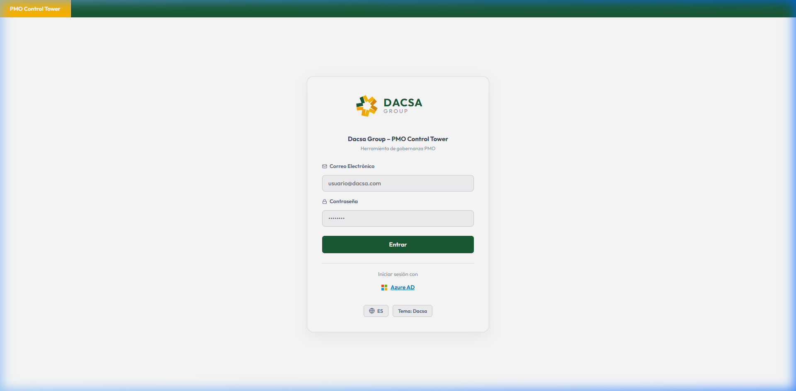

1. Introduzca su **Correo Electrónico Corporativo**.
2. Introduzca su **Contraseña**.
3. Haga clic en **Entrar**.
4. *(Opcional)* En la esquina inferior izquierda puede cambiar el **Idioma** (Español, Inglés, Portugués) y el **Tema Visual** (Dacsa Corporativo u Oscuro).

---

### 2.2. Selector de Ámbito de Trabajo
La plataforma cuenta con segregación por **Ámbitos / Departamentos** (ej. *IT Corporate*, *Operaciones*, *Finanzas*, *Logística*).

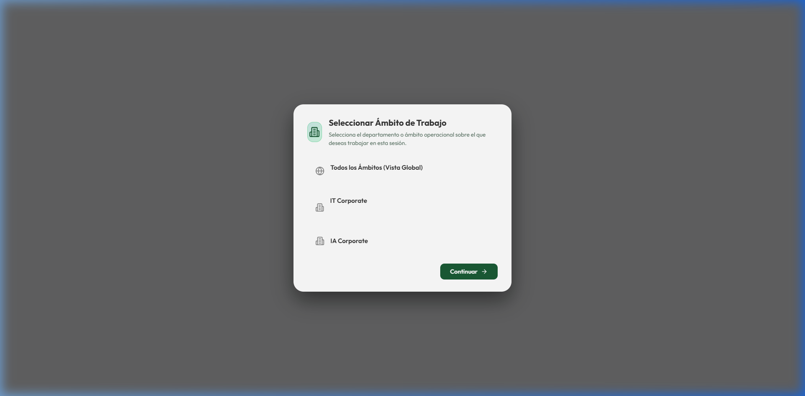

* **Ámbito Específico:** Permite enfocar la vista y trabajar exclusivamente con los proyectos de su departamento.
* **Vista Global (Todos los Ámbitos):** Exclusiva para perfiles de **Dirección** y **Administración**, permitiendo supervisar los proyectos de toda la compañía de forma unificada.
* Puede cambiar de ámbito en cualquier momento desde el menú lateral.

---

## 3. Navegación General y Panel Lateral (Navigation Rail)

La barra de navegación lateral izquierda (*Navigation Rail*) da acceso directo a todas las áreas del sistema:

* 📁 **Proyectos:** Listado general, buscador omnicanal y creación de proyectos.
* 🤝 **Partners / Proveedores:** Directorio 360º de socios tecnológicos y contactos.
* 💡 **Lecciones Aprendidas:** Base de conocimiento de buenas prácticas y errores a evitar.
* 📊 **Dashboard Proyectos:** Métricas operativas, distribución por estados y alertas de desactualización.
* 📈 **Dashboard Portfolio:** Consumo presupuestario, alertas CAPEX e indicadores de volatilidad.
* 💰 **PIPs (Inversiones):** Informe financiero con triple variable (Aprobado, Reservado, Ejecutado).
* 📅 **Timeline (Gantt):** Cronograma interactivo por trimestres, meses y semanas.
* ⚙️ **Administración:** Configuración de flujos, estados, usuarios y mantenimiento (solo Administradores).

> **Consejo:** Puede colapsar el menú lateral a 72px pulsando el botón de colapso en la parte superior para maximizar el espacio de trabajo en pantalla.

---

## 4. Gestión de Cartera de Proyectos (Vista Principal)

Al acceder al módulo principal de **Proyectos**, encontrará el cuadro de mandos con KPIs superiores y la tabla interactiva de proyectos.

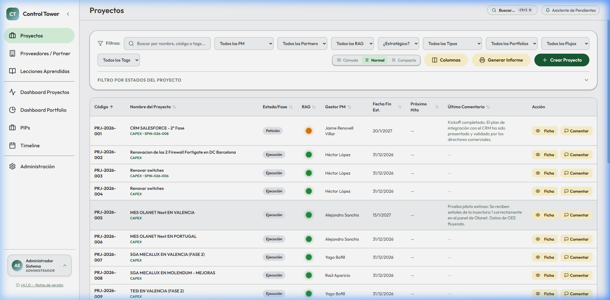

### 4.1. Tarjetas de KPIs Superiores
* **Proyectos Activos:** Número total de iniciativas en curso.
* **Presupuesto Comprometido:** Importe total consumido entre todos los proyectos del ámbito activo.
* **Semáforo RAG:** Distribución de salud (**Verde:** en orden / **Ámbar:** en riesgo / **Rojo:** con bloqueo crítico).
* **Calidad del Dato:** Alertas preventivas de proyectos que llevan más de 14 días sin actualizar su estado o hitos.

### 4.2. Filtros y Búsqueda Omnicanal
* **Buscador Rápido (`Ctrl + K`):** Permite localizar proyectos al instante por nombre, código identificador, código SAP/CAPEX o etiquetas vinculadas (*Tags*).
* **Filtro por Flujo de Trabajo (Workflow):** Adapta automáticamente la lista de estados visibles según el tipo de proyecto seleccionado.
* **Segmentador de Estados:** Filtre con un solo clic los proyectos en fase de *Petición*, *Planificar*, *Kickoff*, *Ejecución*, *Go Live*, etc.
* **Persistencia Inteligente:** Sus filtros y ordenación seleccionados se guardan automáticamente para su próxima sesión.

### 4.3. Alta de un Nuevo Proyecto
Haciendo clic en el botón superior **"+ Nuevo Proyecto"** se despliega el asistente de creación:
* **Proyecto Estándar:** Para iniciativas con presupuesto CAPEX, imputación de facturas y control formal.
* **Iniciativa Ligera:** Para proyectos organizativos o de mejora continua que no requieren código SAP ni presupuesto monetario.

---

## 5. Ficha 360º de Proyecto y Gestión Operativa

Al hacer clic en el botón **"Ficha"** de cualquier proyecto, se accede a su espacio de trabajo completo:

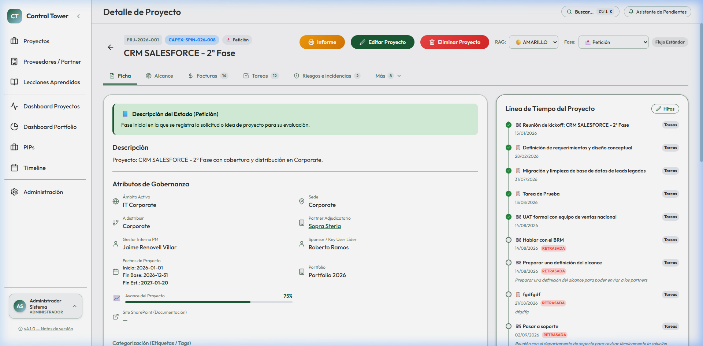

---

### 5.1. Cabecera, RAG y Datos Generales
* **Semáforo RAG (Red-Amber-Green):** Modifique el estado cualitativo del proyecto en tiempo real haciendo clic directo en los botones Verde, Ámbar o Rojo.
* **Fase Actual (Estado del Workflow):** Selector desplegable sincronizado con las fases permitidas del flujo de trabajo del proyecto.
* **Acceso a Documentación:** Enlace directo a la carpeta compartida o site de SharePoint del proyecto.
* **Exportar Informe / Enviar por Correo:** Genere un dossier PDF ejecutivo o redacte un correo electrónico preformateado para los interesados en 2 clics.

---

### 5.2. Pestaña Alcance y Solicitudes de Cambio (CR)
Permite gestionar la trazabilidad de cualquier modificación en los objetivos, presupuesto o fecha final del proyecto.

* **Registro de Change Requests (CR):** Si el proveedor o el negocio solicitan un cambio en el alcance, regístrelo indicando el impacto en coste (€) y en tiempo (días).
* **Aprobación de Cambios:** Al marcar un CR como *Aprobado*, el sistema recalcula automáticamente el **Presupuesto Actualizado** y la **Fecha Fin Estimada**.
* **Índice de Volatilidad de Alcance:** Muestra el porcentaje de desviación presupuestaria respecto a la línea base inicial.

---

### 5.3. Pestaña Finanzas, Facturación y Pedidos (PO)
Proporciona el control económico estricto sin necesidad de abrir el ERP:

* **Control por Número de Pedido (PO):** Asocie cada factura a su orden de compra correspondiente.
* **Facturas Recibidas vs. Pendientes de Recibir:** Permite anticipar el gasto comprometido antes de que la factura sea formalmente tramitada por contabilidad.
* **Alerta Preventiva CAPEX (≥90%):** Indicador visual que advierte cuando el consumo se aproxima al límite presupuestario autorizado.

---

### 5.4. Pestaña Tareas, Hitos y Checklist de Estados
Estructura la ejecución en entregables claros y gobernables:

* **Hitos Clave (Milestones):** Tareas señaladas con el distintivo de hito (🎯) que marcan las fechas clave de entrega y se reflejan en el Timeline y Dashboards.
* **Estados de Tarea Interactivos:** Selector rápido entre `SIN INICIAR`, `EN CURSO` y `COMPLETADA`.
* **Plantillas Automáticas de Estado:** Al avanzar de fase en el proyecto (ej. de *Planificar* a *Kickoff*), el sistema le sugerirá incorporar automáticamente las tareas preconfiguradas para esa etapa.

---

### 5.5. Pestaña Riesgos e Incidencias
Matriz preventiva de amenazas y registro de bloqueos activos:

* **Riesgos Preventivos:** Clasificación por Probabilidad e Impacto (Bajo, Medio, Alto, Crítico) con definición de Plan de Mitigación y Responsable.
* **Incidencias Activas:** Problemas ya materializados que requieren resolución inmediata o escalado.
* **Vinculación con Tareas:** Capacidad de asociar un riesgo directamente a la tarea o hito afectado.

---

### 5.6. Pestaña Comunicación y Notas de Dirección
Muro auditado y gobernanza de información para comités:

* **Notas para Dirección (⭐ DIRECCIÓN):** Comentarios confidenciales visibles únicamente para usuarios con perfil de *Dirección* o *Administrador*.
* **Distintivo ⭐ Informe:** Marca comentarios destacados que se incluirán automáticamente en el resumen ejecutivo del proyecto.
* **Planes de Comunicación Periódicos:** Definición de envíos semanales, mensuales o para el *Steering Committee* con registro de auditoría de envíos.

---

## 6. Dashboards Ejecutivos y Reportes de Portfolio

### 6.1. Dashboard Operativo de Proyectos (`/dashboard`)
Diseñado para el seguimiento diario del equipo de PMO y Project Managers.

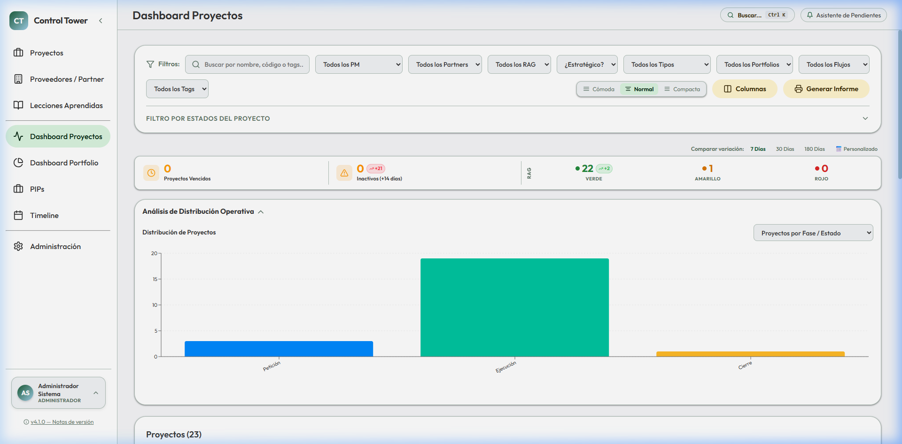

* Gráficos de distribución de proyectos por estado y fase.
* Panel de **Alertas Tempranas:** Proyectos desactualizados (>14 días sin reporte) o con hitos próximos a vencer.
* Segmentación rápida por PM, Partner o Nivel de Riesgo.

---

### 6.2. Dashboard de Portfolio y Salud de Cartera (`/dashboard-portfolio`)
Visión consolidada orientada a Directores de Departamento y Comité de Inversiones.

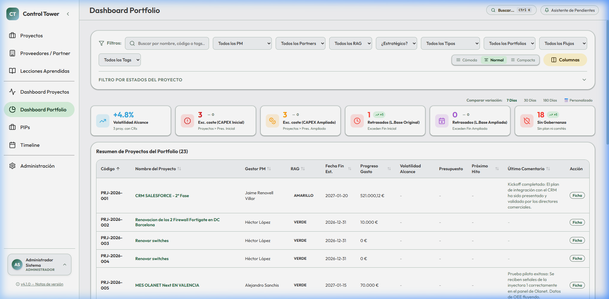

* Resumen global de inversión: Presupuesto Total Aprobado, Consumo Real y Saldo Disponible.
* Desglose financiero por categorías CAPEX/OPEX.
* Visualización de tendencias temporales (*KPI Trends / Velocity*).

---

### 6.3. Informe PIPs — Control Presupuestario de Inversiones (`/portfolios/report`)
Herramienta de control financiero por Portfolio y Unidad de Negocio.

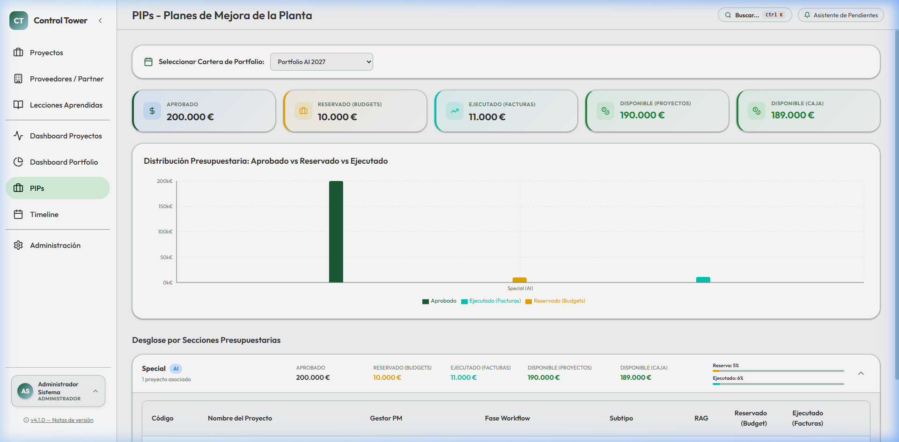

* Gráfico comparativo de **Triple Variable:**
  1. **Aprobado:** Presupuesto formalmente concedido para el ejercicio.
  2. **Reservado:** Fondos comprometidos en proyectos en curso o solicitudes de cambio.
  3. **Ejecutado:** Gasto facturado real hasta la fecha.
* Detalle línea a línea por proyecto y sede de imputación.

---

## 7. Timeline y Diagrama de Gantt Interactivo

El módulo **Timeline** (`/timeline`) ofrece una perspectiva temporal completa de toda la cartera.

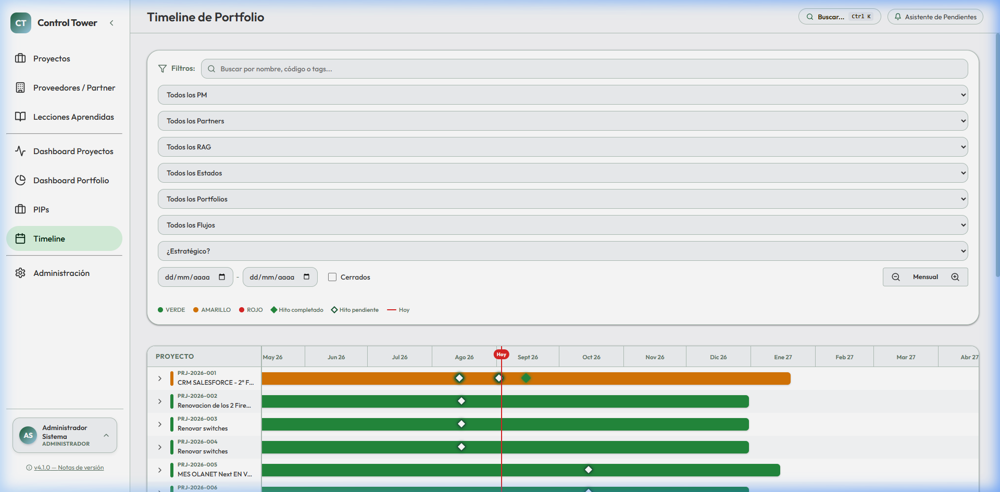

* **Niveles de Zoom:** Conmute fácilmente entre vista **Semanal**, **Mensual** o **Trimestral**.
* **Desglose de Hitos:** Al hacer clic en la fila de un proyecto, se despliegan sus hitos individuales sobre la línea temporal.
* **Filtros Sincronizados:** Filtre por Ámbito, PM, Estado o Proveedor exactamente igual que en la tabla principal.

---

## 8. Directorio de Proveedores y Partners 360º

El módulo de **Proveedores** (`/proveedores`) centraliza la gestión de socios tecnológicos externos.

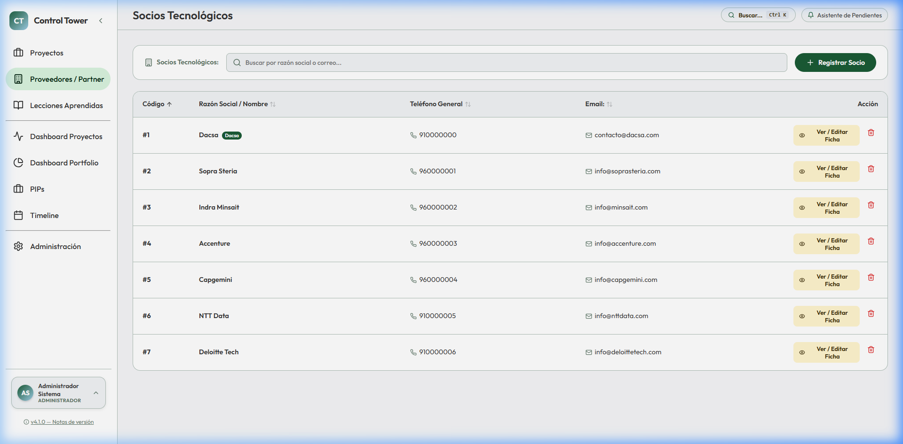

* **Ficha Partner 360º:** Información general, pertenencia a empresas del grupo y directorio de contactos con cargo, teléfono y correo.
* **Proyectos Asignados:** Visión inmediata de todos los proyectos activos asignados a cada partner tecnológico.
* **Evaluación de Calidad:** Histórico de desempeño y lecciones aprendidas vinculadas al proveedor.

---

## 9. Repositorio de Lecciones Aprendidas

El módulo de **Lecciones Aprendidas** (`/lecciones`) actúa como la memoria corporativa de la organización para evitar repetir errores y consolidar éxitos.

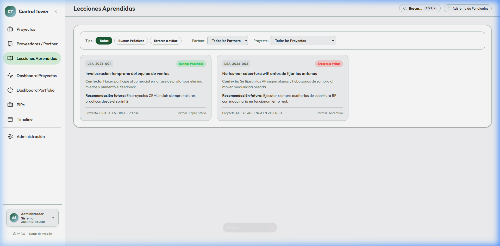

* **Clasificación Dual:**
  * 🟢 **Buenas Prácticas:** Metodologías, soluciones técnicas o acuerdos de éxito a replicar en futuros proyectos.
  * 🔴 **Errores a Evitar:** Problemas imprevistos, cuellos de botella o desviaciones a prevenir.
* **Búsqueda y Filtros:** Búsqueda por tecnología, proveedor asociado o proyecto origen.

---

## 10. Panel de Administración y Configuración (SysOps)

Disponible exclusivamente para usuarios con perfil **ADMINISTRADOR** (`/admin`).

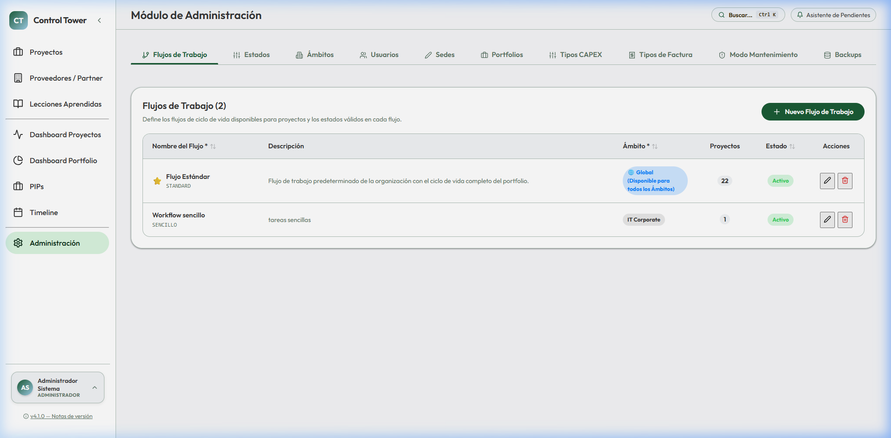

### Capacidades del Panel de Administración:
1. **Flujos de Trabajo (Workflows):** Creación y personalización de flujos de estados adaptados a cada departamento (ej. Flujo IT vs Flujo de Planta).
2. **Estados de Proyecto:** Catálogo maestro de estados, iconos, orden y reglas de cierre.
3. **Gestión de Ámbitos:** Alta y configuración de unidades de negocio o departamentos.
4. **Mantenimiento de Usuarios:** Alta, baja, asignación de perfiles (**ADMINISTRADOR**, **PM**, **DIRECTOR**) y asociación de ámbitos permitidos.
5. **Sedes y Portfolios:** Configuración de centros de trabajo e imputaciones presupuestarias.
6. **Modo Mantenimiento:** Bloqueo temporal de la aplicación con mensaje informativo durante tareas de actualización técnica.
7. **Backups del Sistema:** Descarga y restauración de copias de seguridad de la base de datos.

---

## 11. Atajos de Teclado, Buenas Prácticas y FAQ

### ⚡ Atajos de Teclado Clave
| Atajo | Acción |
| :--- | :--- |
| `Ctrl + K` (o `Cmd + K`) | Abre la paleta de búsqueda omnicanal global desde cualquier pantalla. |
| `Esc` | Cierra cualquier modal o ventana emergente abierta. |
| `Enter` | Confirma la búsqueda o el formulario activo. |

---

### 🏆 Las 5 Buenas Prácticas del Project Manager
1. **Mantenga el Semáforo RAG Actualizado:** Si surge un bloqueo crítico con un proveedor o una fecha clave se retrasa, cambie el RAG a **Ámbar** o **Rojo** e incluya un comentario en el Muro.
2. **No Deje Pasar más de 14 Días sin Reporte:** El indicador de calidad del dato alertará a la Dirección si un proyecto activo no registra actividad reciente.
3. **Formalice los Cambios de Alcance (CR):** Nunca modifique la fecha fin de un proyecto sin registrar la Solicitud de Cambio correspondiente para mantener la línea base histórica.
4. **Cierre de Hitos:** Marque los hitos como `COMPLETADA` en cuanto se alcancen para que el Gantt refleje el avance real.
5. **Registre Lecciones al Finalizar:** Al completar la fase de *Go Live* o *Cierre*, documente al menos una buena práctica o un error a evitar.

---

### ❓ Preguntas Frecuentes (FAQ)

**P: ¿Por qué no veo los proyectos de otro departamento?**
> **R:** La plataforma utiliza segregación por **Ámbitos**. Si pertenece a un departamento específico, solo verá los proyectos de su área. Si necesita acceso transversal, solicite al Administrador la asignación del ámbito correspondiente o perfil de Dirección.

**P: ¿Puedo crear un proyecto que no tiene presupuesto formal todavía?**
> **R:** Sí. Puede crearlo como **Iniciativa Ligera** o dejar los campos CAPEX y presupuesto inicial en blanco. Cuando se apruebe la inversión, podrá añadir el código SAP y presupuesto en la pestaña Finanzas.

**P: ¿Cómo genero un informe para el Comité de Dirección?**
> **R:** Desde la ficha del proyecto, haga clic en **"Exportar Informe"** en la esquina superior derecha para generar un dossier PDF consolidado con KPIs, salud, finanzas y próximos hitos.

---
*Documento generado para el Plan de Capacitación y Despliegue Corporativo de PMO Control Tower.*
