# 🏛️ Manual de Usuario y Guía de Formación — PMO Control Tower
**Plataforma Corporativa de Gobernanza Estratégica, Control Presupuestario y Gestión de Cartera de Proyectos**

---

## 📑 Tabla de Contenidos

1. [Introducción y Propuesta de Valor](#1-introducción-y-propuesta-de-valor)
2. [Acceso, Autenticación y Selección de Ámbito](#2-acceso-autenticación-y-selección-de-ámbito)
   - 2.1. [Pantalla de Inicio de Sesión y Personalización](#21-pantalla-de-inicio-de-sesión-y-personalización)
   - 2.2. [Selector de Ámbito de Trabajo y Segregación Departamental](#22-selector-de-ámbito-de-trabajo-y-segregación-departamental)
3. [Navegación General y Panel Lateral (Navigation Rail)](#3-navegación-general-y-panel-lateral-navigation-rail)
4. [Gestión de Cartera de Proyectos (Vista Principal)](#4-gestión-de-cartera-de-proyectos-vista-principal)
   - 4.1. [Cuadro Superior de KPIs y Salud de Cartera](#41-cuadro-superior-de-kpis-y-salud-de-cartera)
   - 4.2. [Panel de Filtros Avanzados y Búsqueda Omnicanal (`Ctrl + K`)](#42-panel-de-filtros-avanzados-y-búsqueda-omnicanal-ctrl--k)
   - 4.3. [Macro-Etapas y Segmentación por Estados de Workflow](#43-macro-etapas-y-segmentación-por-estados-de-workflow)
   - 4.4. [Tabla Interactiva: Selector de Columnas en Cabecera, Redimensionamiento y Ordenación](#44-tabla-interactiva-selector-de-columnas-en-cabecera-redimensionamiento-y-ordenación)
5. [Creación de un Proyecto: Guía Meticulosa Campo por Campo](#5-creación-de-un-proyecto-guía-meticulosa-campo-por-campo)
   - 5.1. [Tipos de Iniciativa: Proyecto Estándar vs. Iniciativa Ligera](#51-tipos-de-iniciativa-proyecto-estándar-vs-iniciativa-ligera)
   - 5.2. [Desglose Detallado de Todos los Campos del Formulario de Alta](#52-desglose-detallado-de-todos-los-campos-del-formulario-de-alta)
   - 5.3. [Asignación Automática de Tareas por Plantilla de Estado](#53-asignación-automática-de-tareas-por-plantilla-de-estado)
6. [Edición de un Proyecto y Gestión Integral de Subentidades](#6-edición-de-un-proyecto-y-gestión-integral-de-subentidades)
   - 6.1. [Modal de Edición de Ficha Básica](#61-modal-de-edición-de-ficha-básica)
   - 6.2. [Subentidad 1: Ficha 360º de Gobernanza, RACI y Muros de Comunicación](#62-subentidad-1-ficha-360º-de-gobernanza-raci-y-muros-de-comunicación)
   - 6.3. [Subentidad 2: Alcance y Solicitudes de Cambio (CR — Change Requests)](#63-subentidad-2-alcance-y-solicitudes-de-cambio-cr--change-requests)
   - 6.4. [Subentidad 3: Finanzas, Facturación, Pedidos (PO) y Alerta CAPEX](#64-subentidad-3-finanzas-facturación-pedidos-po-y-alerta-capex)
   - 6.5. [Subentidad 4: Checklist Operativo, Tareas e Hitos Clave (🎯)](#65-subentidad-4-checklist-operativo-tareas-e-hitos-clave-)
   - 6.6. [Subentidad 5: Matriz Preventiva de Riesgos e Incidencias Activas](#66-subentidad-5-matriz-preventiva-de-riesgos-e-incidencias-activas)
   - 6.7. [Subentidad 6: Comunicaciones, Planes Periódicos y Auditoría](#67-subentidad-6-comunicaciones-planes-periódicos-y-auditoría)
   - 6.8. [Subentidad 7: Lecciones Aprendidas del Proyecto](#68-subentidad-7-lecciones-aprendidas-del-proyecto)
   - 6.9. [Subentidad 8: Encuestas de Calidad y Cierre de Proyecto](#69-subentidad-8-encuestas-de-calidad-y-cierre-de-proyecto)
7. [Dashboards Ejecutivos y Reportes de Portfolio](#7-dashboards-ejecutivos-y-reportes-de-portfolio)
   - 7.1. [Dashboard Operativo de Proyectos (`/dashboard`)](#71-dashboard-operativo-de-proyectos-dashboard)
   - 7.2. [Dashboard de Portfolio y Salud de Cartera (`/dashboard-portfolio`)](#72-dashboard-de-portfolio-y-salud-de-cartera-dashboard-portfolio)
   - 7.3. [Informe PIPs — Control Presupuestario de Inversiones (`/portfolios/report`)](#73-informe-pips--control-presupuestario-de-inversiones-portfoliosreport)
8. [Timeline y Diagrama de Gantt Interactivo](#8-timeline-y-diagrama-de-gantt-interactivo)
9. [Directorio 360º de Proveedores y Partners](#9-directorio-360º-de-proveedores-y-partners)
10. [Repositorio General de Lecciones Aprendidas](#10-repositorio-general-de-lecciones-aprendidas)
11. [Panel de Administración y Configuración SysOps](#11-panel-de-administración-y-configuración-sysops)
12. [Visor Integrado de Documentación y Ayuda en Línea](#12-visor-integrado-de-documentación-y-ayuda-en-línea)
13. [Atajos de Teclado, Guía de Buenas Prácticas y FAQ](#13-atajos-de-teclado-guía-de-buenas-prácticas-y-faq)

---

## 1. Introducción y Propuesta de Valor

**PMO Control Tower** es la plataforma corporativa de supervisión estratégica y gobernanza diseñada para dotar a la organización de visibilidad integral en tiempo real sobre toda su cartera de inversiones y proyectos.

```
┌─────────────────────────────────────────────────────────────────────────┐
│                           PMO CONTROL TOWER                             │
├───────────────────┬─────────────────────────┬───────────────────────────┤
│  GOBERNANZA 360º  │   CONTROL FINANCIERO    │     ALERTAS TEMPRANAS     │
│  • Semáforo RAG   │ • Presupuesto Base/Act. │ • Desactualización >14 d. │
│  • Matriz RACI    │ • Pedidos Emitidos (PO) │ • Alerta CAPEX (≥90%)     │
│  • Flujos/Estados │ • Facturas Recib/Pend.  │ • Volatilidad de Alcance  │
└───────────────────┴─────────────────────────┴───────────────────────────┘
```

### ¿En qué se diferencia de herramientas operativas (Jira, Planner, Trello)?
* **Enfoque Preventivo y Macro:** No gestiona tickets técnicos individuales ni micro-tareas diarias, sino **hitos críticos de negocio**, **desviaciones de calendario**, **riesgos estratégicos** y **salud presupuestaria**.
* **Control Financiero Anticipado:** Calcula el gasto comprometido integrando órdenes de compra (*PO*), facturas recibidas y facturas pendientes de recibir frente a la línea base aprobada.
* **Gobernanza Auditada y Dirección:** Incorpora canales diferenciados de comunicación (Muro Ejecutivo público vs. **Muro Privado de Dirección ⭐ DIRECCIÓN**) y genera informes ejecutivos consolidados en un clic.

---

## 2. Acceso, Autenticación y Selección de Ámbito

### 2.1. Pantalla de Inicio de Sesión y Personalización
El acceso se realiza mediante la URL corporativa con credenciales individuales o inicio de sesión federado con Microsoft Entra ID (M365).

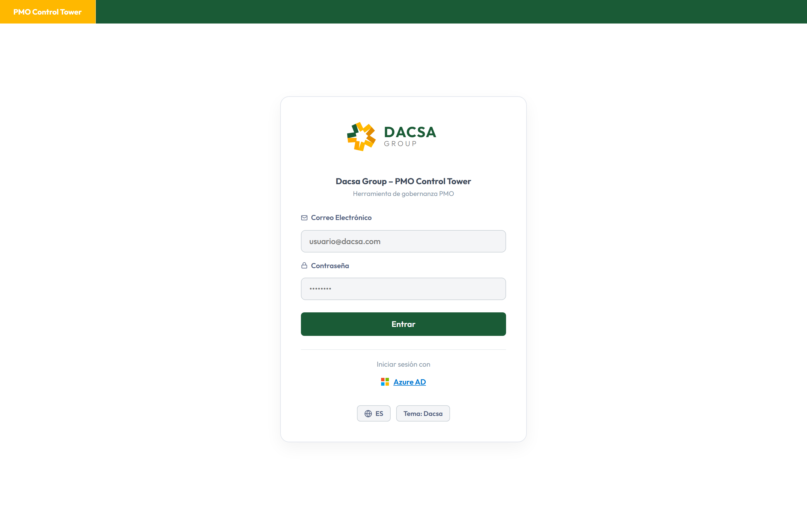

1. Introduzca su **Correo Electrónico Corporativo**.
2. Introduzca su **Contraseña**.
3. Haga clic en **Entrar**.
4. *(Opcional)* En la esquina inferior izquierda puede cambiar el **Idioma** (Español, Inglés, Portugués) y el **Tema Visual** (Dacsa Corporativo u Oscuro).

---

### 2.2. Selector de Ámbito de Trabajo y Segregación Departamental
La plataforma cuenta con segregación por **Ámbitos / Departamentos** (ej. *IT Corporate*, *Operaciones*, *Finanzas*, *Logística*).

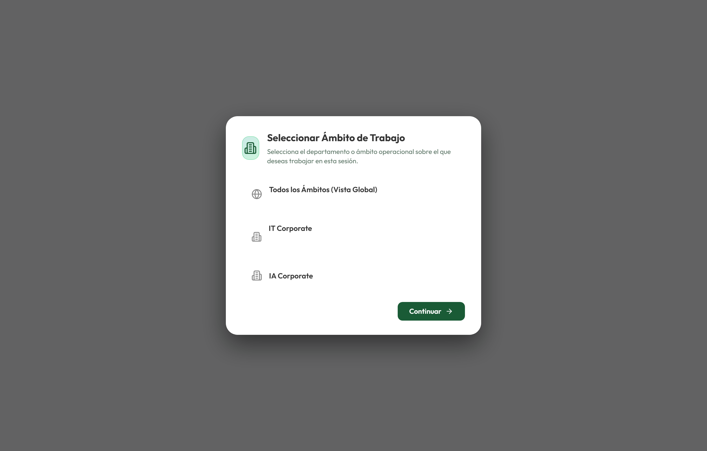

* **Ámbito Específico:** Permite enfocar la vista y trabajar exclusivamente con los proyectos de su departamento o unidad de negocio.
* **Vista Global (Todos los Ámbitos):** Exclusiva para perfiles de **Dirección** y **Administración**, permitiendo supervisar los proyectos de toda la compañía de forma unificada.
* Puede cambiar de ámbito en cualquier momento desde el selector superior del menú lateral.

---

## 3. Navegación General y Panel Lateral (Navigation Rail)

La barra de navegación lateral izquierda (*Navigation Rail*) da acceso directo a todas las áreas del sistema:

* 📁 **Proyectos:** Listado general, cuadro de KPIs, buscador omnicanal y creación/edición de proyectos.
* 📊 **Dashboard Proyectos:** Métricas operativas, distribución por estados y alertas de desactualización.
* 📈 **Dashboard Portfolio:** Consumo presupuestario global, alertas CAPEX e indicadores de volatilidad.
* 💰 **PIPs (Inversiones):** Informe financiero con triple variable (*Aprobado*, *Reservado*, *Ejecutado*).
* 📅 **Timeline (Gantt):** Cronograma interactivo multinivel por trimestres, meses y semanas.
* 🤝 **Proveedores / Partners:** Directorio 360º de socios tecnológicos, contactos y evaluaciones.
* 💡 **Lecciones Aprendidas:** Base de conocimiento de buenas prácticas y errores a evitar.
* ⚙️ **Administración:** Configuración de workflows, estados maestros, usuarios, ámbitos y mantenimiento (solo Administradores).

> **Consejo:** Puede colapsar el menú lateral a 72px pulsando el botón de colapso en la parte superior para maximizar el espacio de trabajo en pantalla.

---

## 4. Gestión de Cartera de Proyectos (Vista Principal)

Al acceder al módulo principal de **Proyectos** (`/proyectos`), encontrará el cuadro de mandos con KPIs superiores, la barra de filtros omnicanal y la tabla interactiva de proyectos.

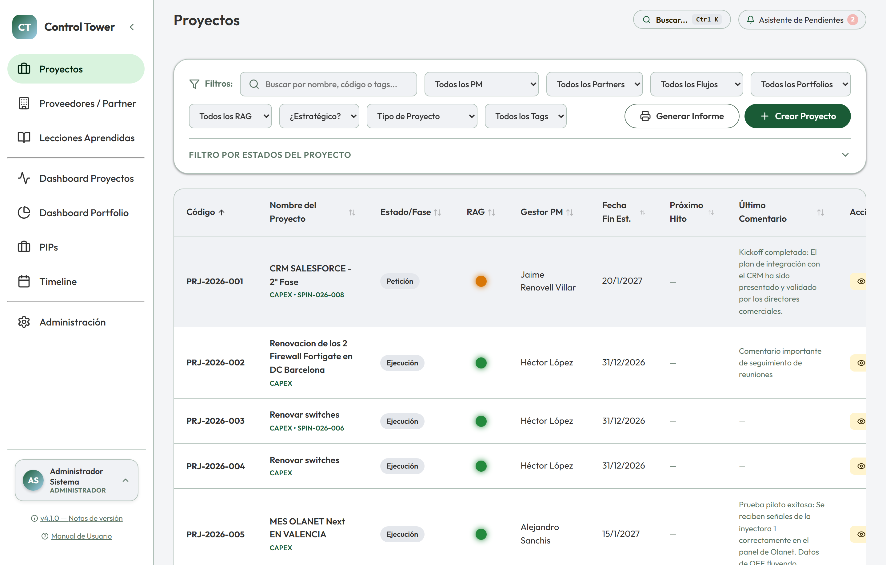

---

### 4.1. Cuadro Superior de KPIs y Salud de Cartera
* **Proyectos Activos:** Número total de iniciativas en curso en el ámbito activo.
* **Presupuesto Comprometido:** Suma monetaria total comprometida entre todos los proyectos visibles.
* **Semáforo RAG:** Distribución de salud cualitativa (**Verde:** en orden / **Amarillo:** en riesgo / **Rojo:** con bloqueo crítico).
* **Calidad del Dato:** Alertas preventivas de proyectos que llevan más de 14 días sin registrar actualizaciones de avance, comentarios o hitos.

---

### 4.2. Panel de Filtros Avanzados y Búsqueda Omnicanal (`Ctrl + K`)
* **Buscador Rápido (`Ctrl + K`):** Permite localizar proyectos al instante por nombre, código `PRJ`, código SAP/CAPEX o etiquetas vinculadas (*Tags*).
* **Filtro por Gestor (PM):** Segmenta la cartera por el Project Manager asignado.
* **Filtro por Socio Tecnológico:** Filtra iniciativas según el proveedor externo involucrado.
* **Filtro por Flujo de Trabajo (Workflow):** Adapta la vista a la metodología seleccionada (*Flujo Estándar*, *Flujo IT*, etc.).
* **Filtro por Portfolio:** Agrupa los proyectos por línea estratégica de inversión.
* **Semáforo RAG:** Filtra proyectos exclusivamente en estado Verde, Amarillo o Rojo.
* **Interruptor Estratégico (⭐):** Muestra únicamente iniciativas marcadas como de alta relevancia corporativa.
* **Tipo de Proyecto:** Conmuta entre *Proyectos Estándar* (con presupuesto) e *Iniciativas Ligeras*.
* **Persistencia Inteligente:** Sus filtros y ordenación seleccionados se guardan automáticamente para su próxima sesión.

---

### 4.3. Macro-Etapas y Segmentación por Estados de Workflow
La barra superior incluye un acordeón de **Segmentación por Estados** organizado en 5 Macro-Etapas del ciclo de vida:

| Macro-Etapa | Estados Típicos Incluidos | Propósito de Gobernanza |
| :--- | :--- | :--- |
| **INICIATIVA** | *Petición*, *Estudio de viabilidad*, *Buscar propuestas* | Captación y evaluación preliminar de ideas y necesidades. |
| **PLANIFICACIÓN** | *Tener aprobación*, *Planificar*, *Kickoff* | Aprobación presupuestaria, definición de alcance y lanzamiento formal. |
| **EJECUCIÓN** | *Ejecución*, *Go Live*, *Estabilización* | Desarrollo, construcción técnica, puesta en marcha y soporte inicial. |
| **PAUSA** | *Pausado* | Proyectos temporalmente suspendidos por prioridad o causas externas. |
| **CIERRE** | *Cierre*, *Descartado*, *Cancelado* | Cierre formal, archivo histórico o cancelación auditada. |

---

### 4.4. Tabla Interactiva: Selector de Columnas en Cabecera, Redimensionamiento y Ordenación
La tabla principal de proyectos incorpora capacidades avanzadas de personalización:

1. **Selector de Columnas en Cabecera (⚙️):** Ubicado en la cabecera de la columna *Acciones*, permite marcar o desmarcar columnas visibles (*Código*, *Nombre*, *Estado*, *RAG*, *Partner*, *PM*, *Sede*, *Fecha Inicio*, *Fecha Fin*, *Presupuesto*, *Consumo*, *Próximo Hito*, *Último Comentario*) y restaurar los valores por defecto.
2. **Redimensionamiento de Columnas:** Arrastre con el ratón el divisor lateral de cualquier columna en la cabecera para ajustar libremente su anchura.
3. **Ordenación Multi-Columna:** Haga clic en cualquier título de columna para ordenar de forma ascendente o descendente.
4. **Acceso Rápido:**
   - **👁️ Ficha:** Abre la vista de detalle 360º del proyecto.
   - **💬 Comentario Rápido:** Permite registrar un comentario o nota de dirección al instante sin salir de la tabla.

---

## 5. Creación de un Proyecto: Guía Meticulosa Campo por Campo

Al hacer clic en el botón superior **"+ Nuevo Proyecto"**, se abre el asistente modal de alta:

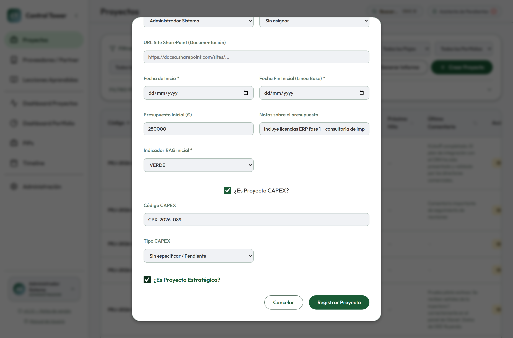

---

### 5.1. Tipos de Iniciativa: Proyecto Estándar vs. Iniciativa Ligera
En el primer selector del formulario debe determinarse la naturaleza de la iniciativa:

* **📁 Proyecto Estándar (con Presupuesto / CAPEX / Proveedor):** Para iniciativas corporativas completas que requieren imputación contable, control de pedidos PO, facturas, asignación de socio tecnológico y código CAPEX.
* **⚡ Iniciativa Ligera / Tarea Individual (Sin CAPEX / Sin Presupuesto):** Para proyectos organizativos, mejoras internas, estudios o tareas individuales que no requieren código SAP, presupuesto monetario ni facturas, agilizando el formulario.

---

### 5.2. Desglose Detallado de Todos los Campos del Formulario de Alta

A continuación se describe exhaustivamente cada campo del formulario:

| Campo | Tipo | Obligatorio | Descripción y Finalidad |
| :--- | :--- | :---: | :--- |
| **Tipo de Iniciativa** | Desplegable | Sí | Define si es *Proyecto Estándar* (con control financiero) o *Iniciativa Ligera* (sin presupuesto). |
| **Código Proyecto** | Texto | No | Código identificador formal (formato `PRJ-YYYY-XXX`, ej. `PRJ-2026-089`). **Si se deja vacío, el sistema asigna automáticamente el siguiente código correlativo disponible.** |
| **Nombre del Proyecto** | Texto | Sí | Título descriptivo y conciso que identifique la iniciativa de forma inequívoca en toda la organización. |
| **Descripción del Proyecto** | Área de Texto | Sí | Resumen ejecutivo del objetivo de negocio, justificación estratégica, necesidades a cubrir y alcance principal. |
| **Sede de Operación** | Desplegable | Sí | Centro de trabajo, fábrica o ubicación corporativa principal donde se implementa o imputa la iniciativa. |
| **A Distribuir** | Desplegable | No | Sede secundaria en proyectos con imputación compartida o despliegue intercentros. |
| **Socio Tecnológico** | Desplegable | Sí *(Estándar)* | Empresa proveedora externa o partner tecnológico responsable del desarrollo, licencias o consultoría. |
| **Ámbito de Trabajo** | Desplegable | Sí | Unidad de negocio o departamento propietario del proyecto (ej. *IT Corporate*, *Operaciones*, *Finanzas*). |
| **Flujo de Trabajo (Workflow)** | Desplegable | Sí | Metodología y ciclo de vida de estados aplicables al proyecto (ej. *Flujo Estándar*, *Flujo IT*, *Flujo Planta*). |
| **Fase / Estado Inicial** | Desplegable | Sí | Estado con el que arrancará el proyecto (por defecto la primera fase del workflow, ej. *Petición* o *Kickoff*). |
| **PM Asignado** | Desplegable | Sí | Project Manager responsable del liderazgo, ejecución y actualización periódica del proyecto. |
| **Portfolio** | Desplegable | No | Agrupador estratégico de inversiones para reportes consolidados (ej. *Transformación Digital*, *Ciberseguridad*). |
| **URL Site SharePoint** | Texto URL | No | Enlace web directo a la carpeta compartida, biblioteca de documentos o sitio de SharePoint del proyecto. |
| **Fecha de Inicio** | Fecha | Sí | Fecha formal planificada de inicio de los trabajos del proyecto. |
| **Fecha Fin Inicial (Línea Base)** | Fecha | Sí | Fecha comprometida original de finalización. **Queda fijada como Línea Base histórica** para medir desviaciones. |
| **Presupuesto Inicial (€)** | Numérico | No *(Estándar)* | Importe monetario inicial aprobado para la ejecución del proyecto. |
| **Notas sobre el Presupuesto** | Texto | No | Aclaraciones sobre conceptos incluidos o excluidos (ej. "Incluye licencias fase 1 + consultoría; no incluye hardware"). |
| **Indicador RAG Inicial** | Desplegable | Sí | Semáforo de salud de arranque: 🟢 *VERDE* (en orden), 🟡 *AMARILLO* (en riesgo), 🔴 *ROJO* (bloqueo crítico). |
| **¿Es Proyecto CAPEX?** | Checkbox | No *(Estándar)* | Habilita el control de inversiones de capital desplegando los campos de código y categorización contable. |
| **Código CAPEX** | Texto | No | Código formal de inversión CAPEX asignado por el departamento financiero (ej. `CPX-2026-089`). |
| **Tipo CAPEX** | Desplegable | No | Categoría contable de inversión (ej. *Software / Licencias*, *Equipamiento*, *Infraestructura*). |
| **Subtipo CAPEX** | Desplegable | No | Subclasificación contable vinculada al Tipo CAPEX seleccionado. |
| **¿Es Proyecto Estratégico?** | Checkbox | No | Marca de alta prioridad corporativa con distintivo ⭐ visible en tablas y seguimiento preferente en Dirección. |

---

### 5.3. Asignación Automática de Tareas por Plantilla de Estado
Si el estado inicial seleccionado en el workflow cuenta con **Tareas Plantilla** configuradas por el Administrador, al hacer clic en **Registrar Proyecto** aparecerá una ventana de confirmación interactiva:

* Permite seleccionar qué tareas o hitos predefinidos desea incorporar de inmediato al proyecto.
* Las fechas límite se calculan y sincronizan automáticamente a partir de la fecha de inicio del proyecto.
* Puede confirmar la importación o pulsar *Omitir* para registrar el proyecto con su lista de tareas vacía.

---

## 6. Edición de un Proyecto y Gestión Integral de Subentidades

Haciendo clic en el botón **"Ficha"** de cualquier proyecto se accede a su espacio de trabajo 360º.

---

### 6.1. Modal de Edición de Ficha Básica
Pulsando el botón **"Editar Ficha"** en la parte superior del detalle, se despliega el formulario modal de modificación de metadatos estructurales:

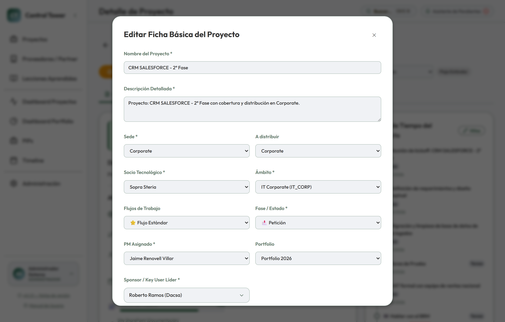

* Permite actualizar en cualquier momento el nombre, descripción, sede, sede a distribuir, socio tecnológico, PM asignado, sponsor, portfolio, workflow, estado actual, código y tipo CAPEX, presupuesto inicial, notas, URL de SharePoint y contactos involucrados.
* Todas las modificaciones quedan registradas en el histórico de auditoría del sistema.

---

### 6.2. Subentidad 1: Ficha 360º de Gobernanza, RACI y Muros de Comunicación
La pestaña principal **Ficha** condensa la visión ejecutiva completa:

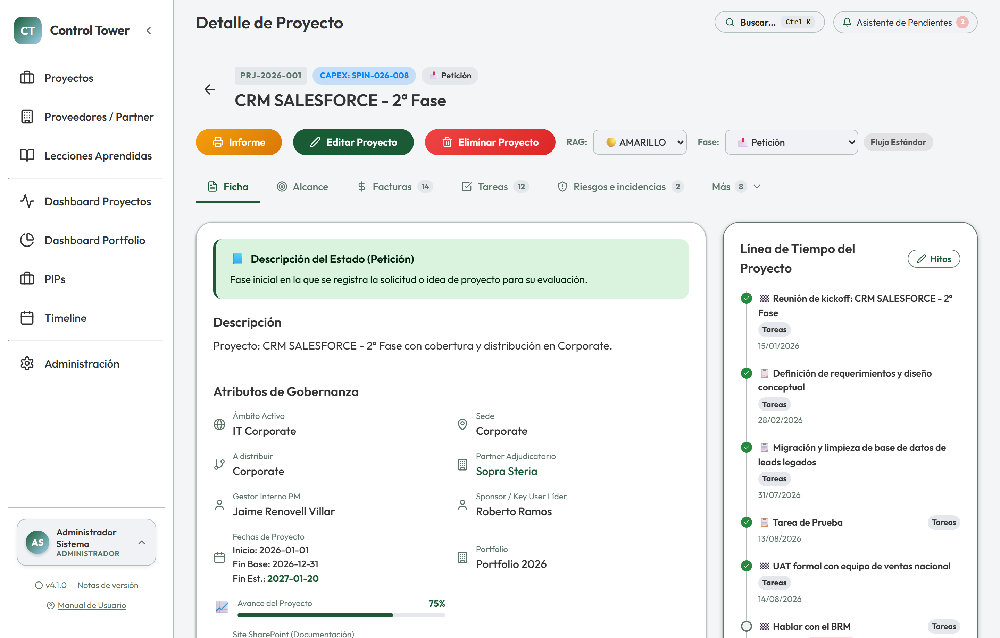

#### Elementos Clave de la Ficha:
1. **Semáforo RAG Interactivo:** Cambie la salud del proyecto en tiempo real haciendo clic directo en **VERDE**, **AMARILLO** o **ROJO**.
2. **Selector de Fase Actual:** Permite avanzar de estado en el workflow. Al cambiar de fase, el sistema sugiere incorporar las tareas plantilla correspondientes a la nueva etapa.
3. **Cuadro de Atributos de Gobernanza:** Visualiza Sponsor, Sede, Código SAP, Socio Tecnológico, Fechas y enlace directo a la documentación en SharePoint.
4. **Matriz RACI (*Responsible, Accountable, Consulted, Informed*):**
   * Estructura formalmente el equipo de trabajo asignando roles (*Responsable de Ejecución*, *Aprobador Final*, *Consultado*, *Informado*).
   * Asocia nombres, cargos, teléfonos y correos electrónicos con enlaces directos.
5. **Muro Ejecutivo de Comunicación:**
   * Registro cronológico de notas, acuerdos, actas y decisiones de seguimiento.
   * **Distintivo ⭐ Informe:** Marca comentarios destacados que se incluirán automáticamente en el resumen ejecutivo generado para el Comité.
6. **Muro Privado de Dirección (⭐ DIRECCIÓN):**
   * Canal confidencial y seguro visible **únicamente** para usuarios con rol **DIRECTOR** o **ADMINISTRADOR**.
   * Permite registrar valoraciones estratégicas sensibles, riesgos de negociación con proveedores o notas confidenciales de inversión sin visibilidad para el resto de perfiles.
7. **Cronograma Unificado de Hitos:** Línea temporal resumida con los próximos hitos críticos del proyecto.

---

### 6.3. Subentidad 2: Alcance y Solicitudes de Cambio (CR — Change Requests)
La pestaña **Alcance** centraliza la definición técnica y la gobernanza de variaciones:

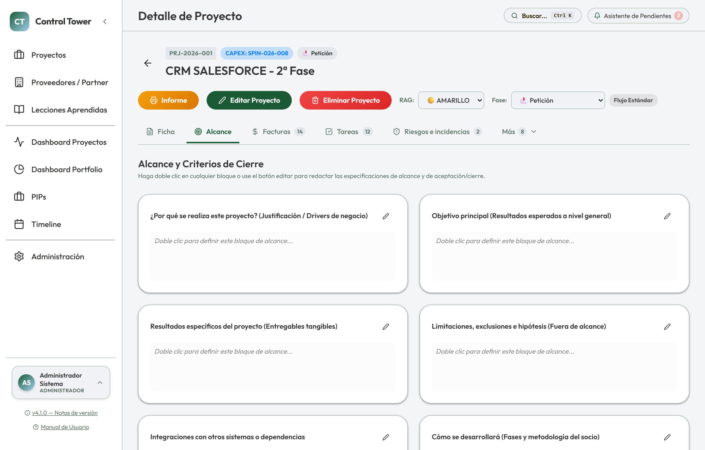

* **Definición de Alcance:** Bloques editables con *Objetivos*, *Entregables Incluidos*, *Exclusiones Explícitas* y *Criterios de Aceptación*.
* **Registro de Solicitudes de Cambio (CR):**
  * Toda petición de modificación en alcance, plazo o coste debe formalizarse mediante un CR.
  * Campos: Código CR, Título, Justificación, **Impacto en Coste (€)**, **Impacto en Plazo (días)** y Estado (*Pendiente*, *Aprobado*, *Rechazado*).
* **Recálculo Automático de Línea Base:** Al marcar un CR como *Aprobado*, el sistema recalcula automáticamente el **Presupuesto Actualizado** y la **Fecha Fin Estimada**.
* **Índice de Volatilidad de Alcance:** Muestra el porcentaje de variación presupuestaria acumulada frente a la línea base inicial.

---

### 6.4. Subentidad 3: Finanzas, Facturación, Pedidos (PO) y Alerta CAPEX
La pestaña **Facturas / Finanzas** proporciona el control presupuestario estricto:

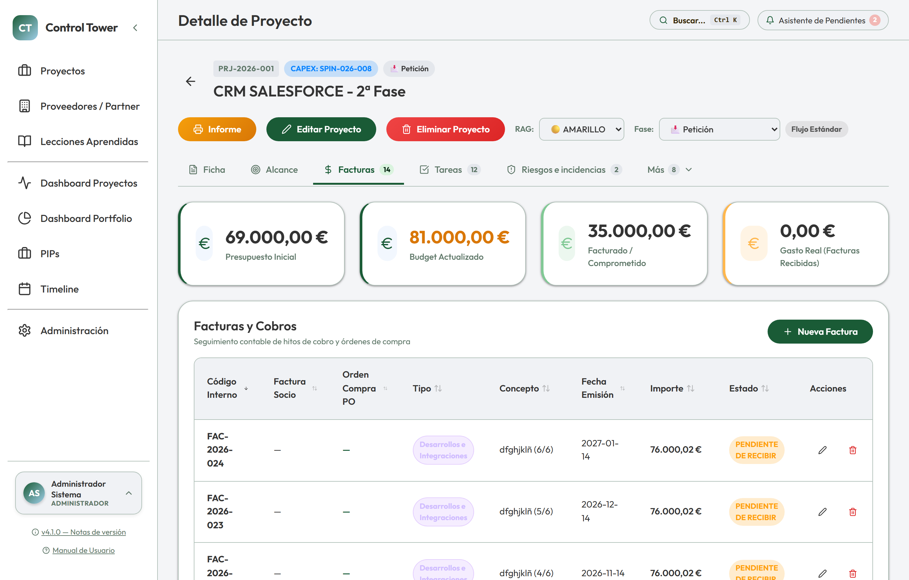

* **Tarjetas Financieras Consolidadas:**
  * **Presupuesto Inicial (Línea Base):** Importe aprobado original.
  * **Presupuesto Actualizado:** Presupuesto base + impacto acumulado de CRs aprobados.
  * **Total Facturado (Recibido):** Importe de facturas formalmente contabilizadas.
  * **Comprometido Pendiente:** Facturas pendientes de recibir y pedidos emitidos.
  * **Saldo Disponible:** Presupuesto restante no comprometido.
* **Alerta Preventiva CAPEX (≥90%):** Indicador visual en color rojo/amarillo que advierte cuando el consumo acumulado se aproxima al límite presupuestario autorizado.
* **Gestión por Número de Pedido (PO):** Asocie cada factura a su orden de compra correspondiente en el ERP.
* **Facturas Recibidas vs. Pendientes de Recibir:** Permite imputar costes comprometidos antes de que la factura física sea tramitada por contabilidad.
* **Previsualización de Facturas Recurrentes:** Generador de calendarios de pagos periódicos (mensuales/trimestrales).

---

### 6.5. Subentidad 4: Checklist Operativo, Tareas e Hitos Clave (🎯)
La pestaña **Tareas / Checklist** estructura la ejecución en entregables gobernables:

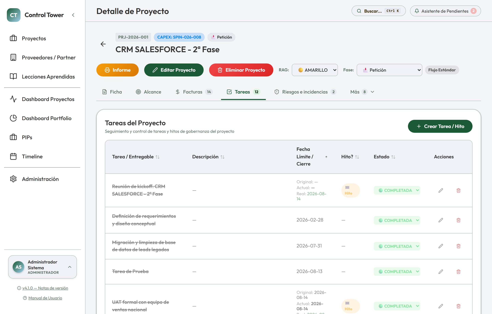

* **Gestión de Tareas:** Nombre, descripción, responsable asignado, fecha límite y estado interactivo (`SIN INICIAR`, `EN CURSO`, `COMPLETADA`, `BLOQUEADA`).
* **Hitos Clave (🎯 Milestones):** Tareas señaladas con el distintivo de hito que marcan entregas críticas y se sincronizan automáticamente con el Timeline general, diagramas de Gantt y dashboards ejecutivos.
* **Importación Dinámica:** Capacidad de añadir nuevas tareas manualmente o importar plantillas predefinidas según la fase del workflow.

---

### 6.6. Subentidad 5: Matriz Preventiva de Riesgos e Incidencias Activas
La pestaña **Riesgos e Incidencias** combina la gestión predictiva con la resolución de bloqueos:

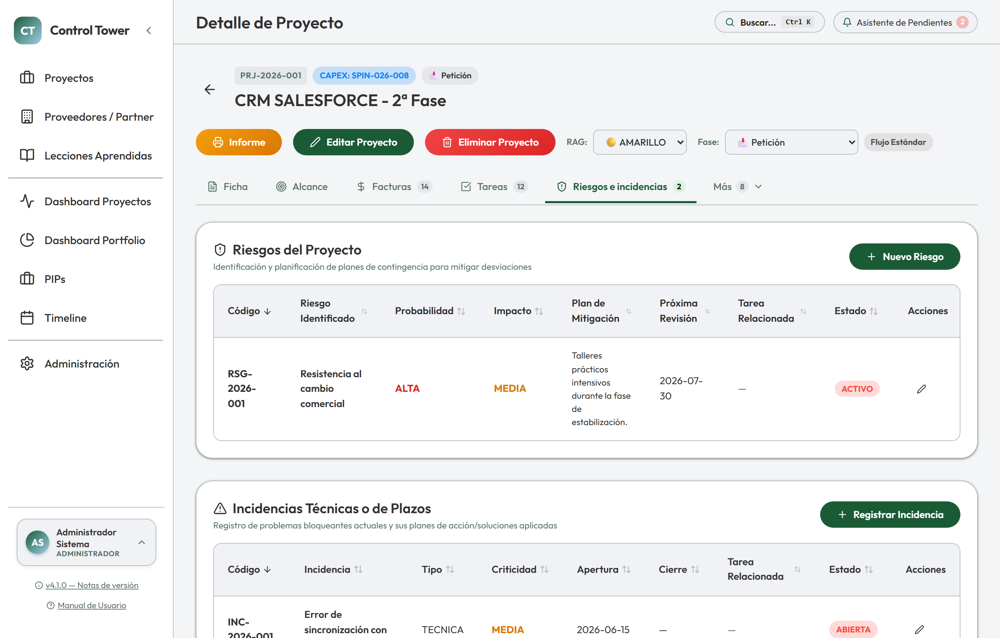

* **Matriz de Riesgos Preventivos:**
  * Evaluación por **Probabilidad** (*Baja*, *Media*, *Alta*) e **Impacto** (*Bajo*, *Medio*, *Alto*, *Crítico*).
  * Cálculo automatizado del **Nivel de Severidad** (*Bajo*, *Medio*, *Alto*, *Crítico*).
  * Definición obligatoria de **Plan de Mitigación**, **Responsable de Mitigación** y **Tarea/Hito Vinculado**.
* **Registro de Incidencias Activas:**
  * Problemas o bloqueos materializados que impactan en el avance del proyecto.
  * Registro de impacto, plan de contingencia, severidad y estado de resolución (*Abierta*, *En Progreso*, *Resuelta*).

---

### 6.7. Subentidad 6: Comunicaciones, Planes Periódicos y Auditoría
La pestaña **Comunicación** (disponible en el desplegable *"Más ▾"*) gestiona los reportes a stakeholders:

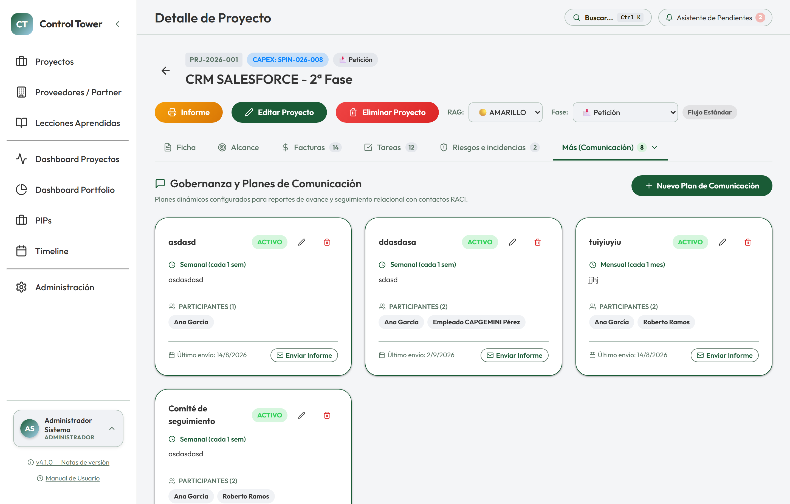

* **Planes de Comunicación Periódicos:** Configure envíos programados (*Semanal*, *Quincenal*, *Mensual*, *Comité SteerCo*) definiendo destinatarios y finalidad.
* **Auditoría de Envíos:** Historial completo que registra fecha, emisor, destinatarios y contenido de cada comunicado formal transmitido.

---

### 6.8. Subentidad 7: Lecciones Aprendidas del Proyecto
La pestaña **Lecciones Aprendidas** (disponible en el desplegable *"Más ▾"*) alimenta la base de conocimiento:

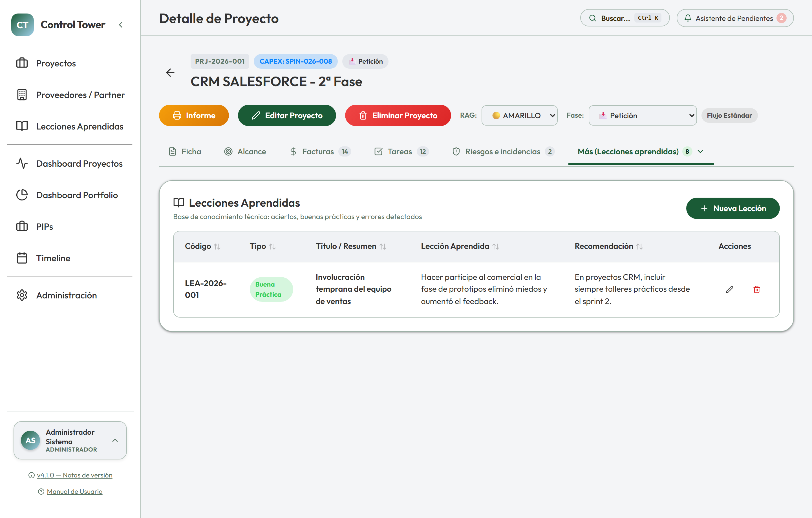

* **🟢 Buenas Prácticas:** Metodologías, soluciones de arquitectura o acuerdos de éxito a replicar en futuros proyectos.
* **🔴 Errores a Evitar:** Cuellos de botella, problemas imprevistos o estimaciones erróneas que deben prevenirse.
* Vinculación automática con el socio tecnológico y tecnología utilizada.

---

### 6.9. Subentidad 8: Encuestas de Calidad y Cierre de Proyecto
* **Encuestas de Calidad:** Evaluación formal del grado de satisfacción de los usuarios finales y stakeholders con el resultado del proyecto.
* **Cierre Formal de Proyecto:** Verificación del checklist de entrega de documentación técnica, actas de recepción formal, cierre administrativo de pedidos y archivado histórico.

---

## 7. Dashboards Ejecutivos y Reportes de Portfolio

### 7.1. Dashboard Operativo de Proyectos (`/dashboard`)
Orientado al seguimiento diario y control operativo de la cartera de proyectos activos:

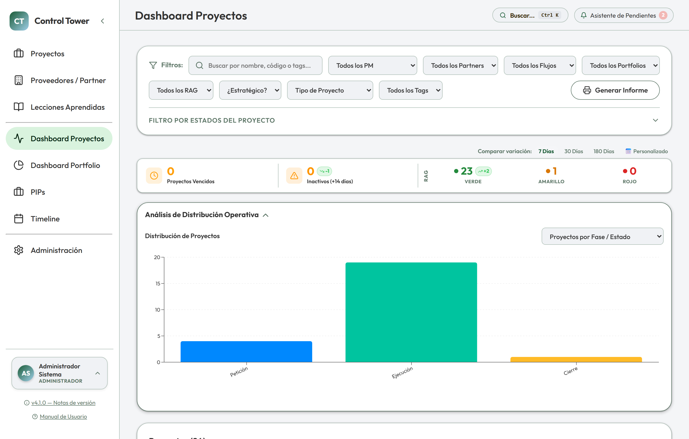

* Gráficos de distribución de proyectos por estado y fase de workflow.
* Panel de **Alertas Tempranas:** Detección de proyectos con más de 14 días sin reporte y proyectos con hitos próximos a vencer.
* Segmentación rápida por PM, Socio Tecnológico y Nivel de Riesgo.

---

### 7.2. Dashboard de Portfolio y Salud de Cartera (`/dashboard-portfolio`)
Visión consolidada orientada a Directores de Departamento, CIO y Comité de Inversiones:

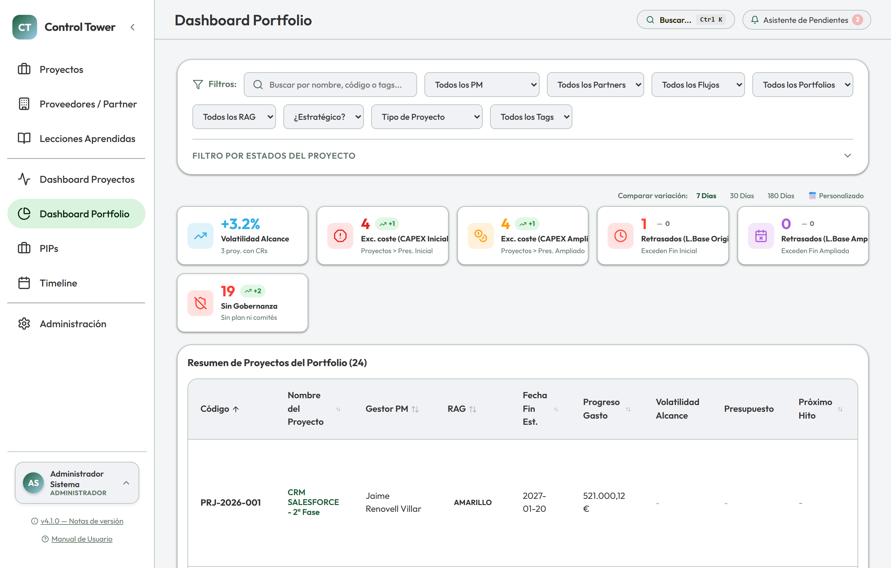

* **Resumen Global de Inversión:** Presupuesto Total Aprobado, Consumo Real Facturado y Saldo Disponible.
* Desglose financiero por categorías CAPEX vs. OPEX.
* Indicadores de volatilidad de cartera y tendencias de avance (*KPI Trends / Velocity*).

---

### 7.3. Informe PIPs — Control Presupuestario de Inversiones (`/portfolios/report`)
Herramienta de control financiero multinivel por Portfolio y Unidad de Negocio:

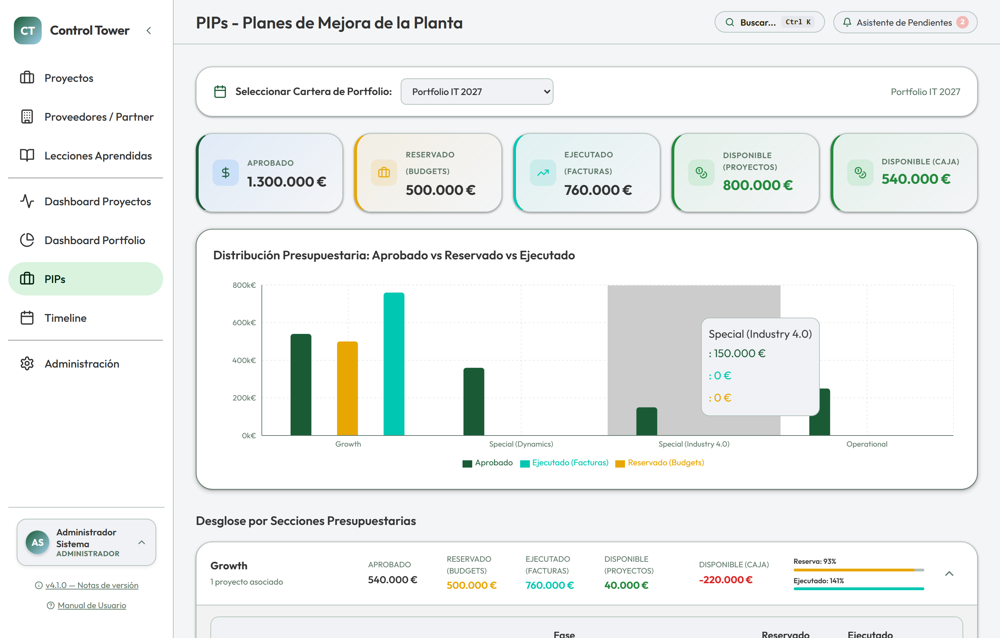

* Gráfico comparativo de **Triple Variable:**
  1. **Aprobado:** Presupuesto formalmente concedido para el ejercicio.
  2. **Reservado:** Fondos comprometidos en proyectos en curso o solicitudes de cambio pendientes.
  3. **Ejecutado:** Gasto real facturado hasta la fecha.
* Tabla detallada línea a línea por proyecto, centro de coste y sede de imputación.

---

## 8. Timeline y Diagrama de Gantt Interactivo

El módulo **Timeline** (`/timeline`) ofrece la perspectiva cronológica completa de la cartera:

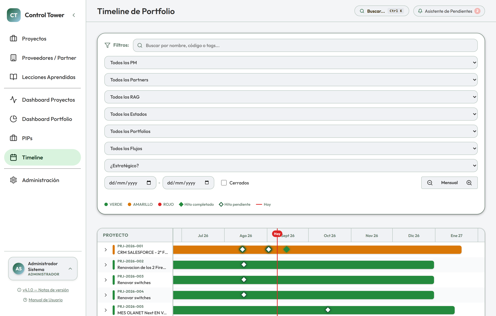

* **Niveles de Zoom Temporal:** Conmute libremente entre vista **Semanal**, **Mensual** o **Trimestral**.
* **Desglose de Hitos:** Al hacer clic en cualquier proyecto se despliega su línea de hitos individuales (🎯).
* **Filtros Sincronizados:** Filtre por Ámbito, PM, Estado o Proveedor exactamente igual que en la tabla principal.

---

## 9. Directorio 360º de Proveedores y Partners

El módulo de **Proveedores** (`/proveedores`) centraliza la gobernanza de socios tecnológicos externos:

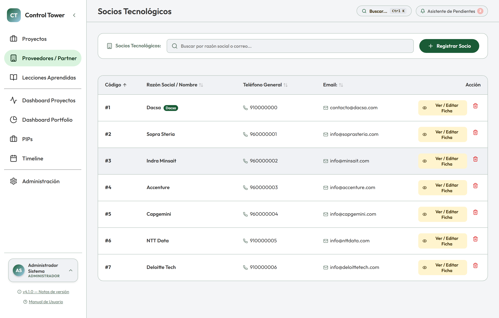

* **Ficha Partner 360º:** Razón social, identificación de grupo empresarial, teléfono y correo general.
* **Directorio de Contactos:** Lista de interlocutores con cargo, teléfono directo y correo.
* **Proyectos Asignados:** Visión inmediata de todas las iniciativas activas e históricas asignadas al proveedor.
* **Historial de Calidad:** Registro consolidado de lecciones aprendidas y rendimiento asociadas al partner.

---

## 10. Repositorio General de Lecciones Aprendidas

El módulo de **Lecciones Aprendidas** (`/lecciones`) actúa como la memoria corporativa transversal:

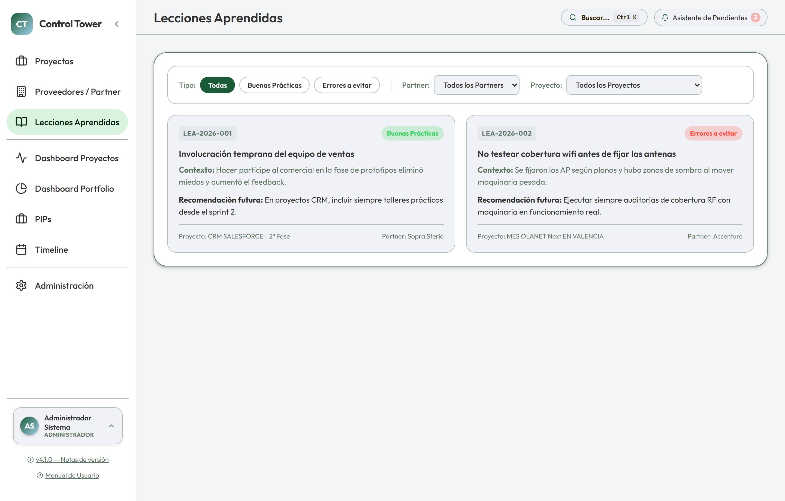

* **Clasificación Dual:**
  * 🟢 **Buenas Prácticas:** Soluciones exitosas a replicar.
  * 🔴 **Errores a Evitar:** Riesgos y problemas a prevenir en nuevos pliegos.
* **Buscador y Filtros:** Localice lecciones por palabra clave, tecnología, socio tecnológico o proyecto de origen.

---

## 11. Panel de Administración y Configuración SysOps

Disponible exclusivamente para usuarios con perfil **ADMINISTRADOR** (`/admin`):

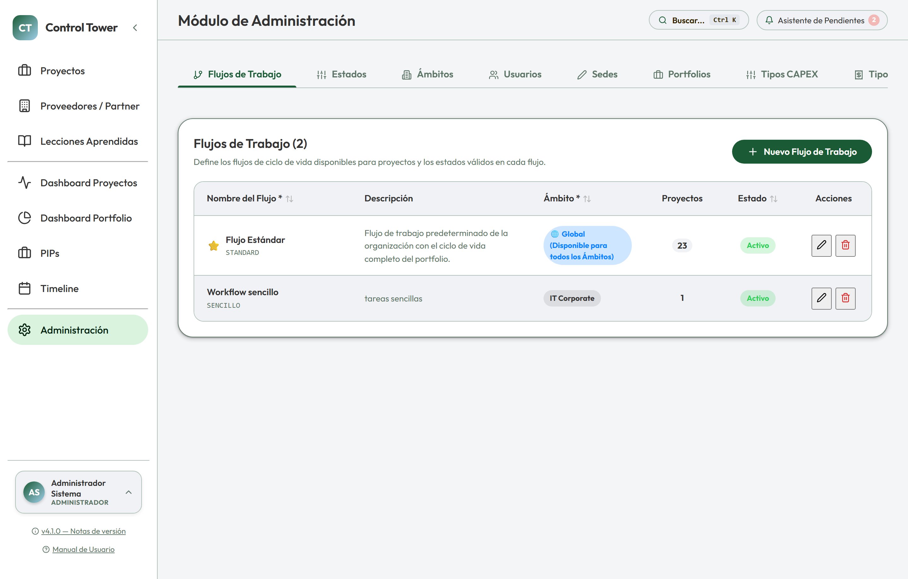

### Capacidades del Panel de Administración:
1. **Flujos de Trabajo (Workflows):** Creación y personalización de flujos de estados adaptados a cada departamento (ej. *Flujo IT*, *Flujo Planta*, *Flujo Marketing*).
2. **Catálogo de Estados:** Configuración de nombres, códigos, iconos emoji, ordenación y reglas de cierre.
3. **Gestión de Ámbitos:** Alta y parametrización de unidades de negocio y departamentos.
4. **Mantenimiento de Usuarios:** Alta, baja, asignación de perfiles (**ADMINISTRADOR**, **PM**, **DIRECTOR**) y asignación de ámbitos autorizados.
5. **Portfolios y Sedes:** Catálogo de centros de trabajo y líneas estratégicas de inversión.
6. **Modo Mantenimiento:** Bloqueo temporal del acceso a la aplicación con mensaje informativo durante tareas de actualización técnica.
7. **Backups del Sistema:** Descarga y restauración segura de copias de seguridad de la base de datos.

---

## 12. Visor Integrado de Documentación y Ayuda en Línea

La plataforma incorpora un **Visor Interactivo del Manual de Usuario** accesible desde cualquier pantalla haciendo clic en el icono de ayuda (❓) o en el botón del manual:

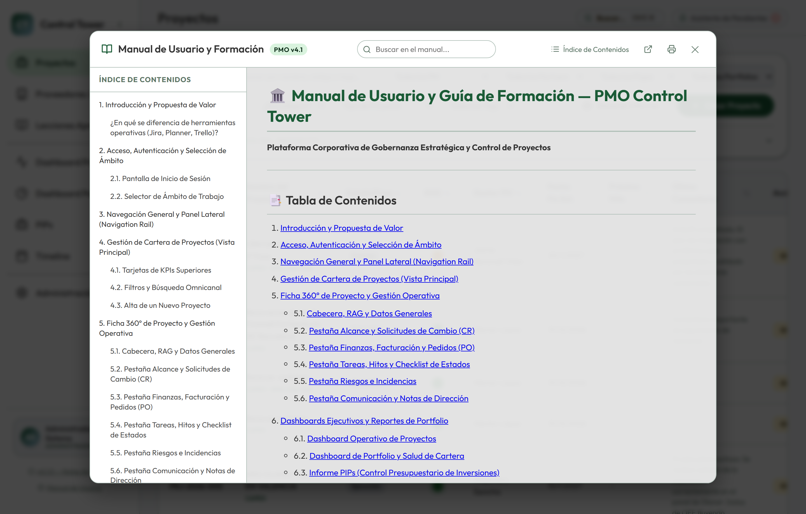

* **Buscador en Tiempo Real:** Localice conceptos y secciones al instante.
* **Tabla de Contenidos Interactiva:** Navegación fluida por capítulos y subsecciones.
* **Zoom de Capturas (Lightbox):** Haga clic en cualquier captura de pantalla para ampliarla en alta definición.
* **Impresión / Exportación:** Botón directo para imprimir o guardar el manual en PDF.

---

## 13. Atajos de Teclado, Guía de Buenas Prácticas y FAQ

### ⚡ Atajos de Teclado Clave
| Atajo | Acción |
| :--- | :--- |
| `Ctrl + K` (o `Cmd + K`) | Abre la paleta de búsqueda omnicanal global desde cualquier pantalla. |
| `Esc` | Cierra cualquier modal, visor o ventana emergente abierta. |
| `Enter` | Confirma la búsqueda o el formulario activo. |

---

### 🏆 Las 6 Buenas Prácticas del Project Manager
1. **Mantenga el Semáforo RAG Actualizado:** Si surge un riesgo crítico o una fecha clave se retrasa, cambie el RAG a **Amarillo** o **Rojo** e incluya una justificación en el Muro.
2. **Actualice el Proyecto al menos cada 14 Días:** El indicador de calidad del dato alertará a la Dirección si un proyecto activo no registra actividad reciente.
3. **Formalice los Cambios de Alcance (CR):** Nunca modifique fechas o costes acordados sin registrar la Solicitud de Cambio correspondiente para salvaguardar la línea base histórica.
4. **Cierre Puntual de Hitos:** Marque los hitos (🎯) como `COMPLETADA` en cuanto se alcancen para mantener sincronizados el Timeline y los Dashboards.
5. **Uso Adecuado del Muro de Dirección:** Utilice el Muro Privado de Dirección (⭐ DIRECCIÓN) para observaciones confidenciales o riesgos estratégicos internos.
6. **Documente Lecciones Aprendidas:** Al alcanzar el *Go Live* o *Cierre*, registre al menos una buena práctica o un error a evitar para enriquecer la base de conocimiento de la empresa.

---

### ❓ Preguntas Frecuentes (FAQ)

**P: ¿Por qué no veo los proyectos de otro departamento?**
> **R:** La plataforma utiliza segregación por **Ámbitos**. Si pertenece a un departamento específico, solo verá los proyectos de su área. Si requiere acceso transversal, solicite a un Administrador la asignación de ámbitos adicionales o perfil de Dirección.

**P: ¿Puedo crear una iniciativa que no requiere presupuesto formal?**
> **R:** Sí. Seleccione **Iniciativa Ligera / Tarea Individual** en el primer campo del formulario de alta. Esto ocultará los campos CAPEX y presupuestarios.

**P: ¿Cómo genero un informe ejecutivo para el Comité de Dirección?**
> **R:** Desde la ficha del proyecto, haga clic en el botón superior **"Exportar Informe"** o **"Generar Reporte"** para obtener un dossier PDF consolidado con KPIs, salud, finanzas y próximos hitos.

---
*Documento oficial para el Plan de Capacitación, Despliegue y Gobernanza Corporativa de PMO Control Tower.*
