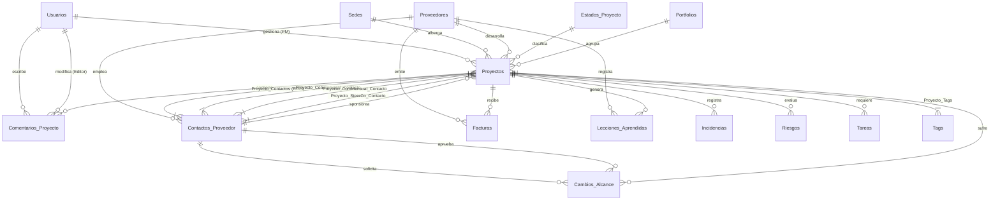

# 📑 Documento de Diseño de Solución (SDD) y Análisis Técnico
## Sistema: PMO Control Tower (PPM - Portfolio Management & Governance Dashboard)

Este documento detalla la especificación funcional, arquitectura técnica, modelo de datos y reglas de negocio del sistema **PMO Control Tower**, con el objetivo de transferir el conocimiento técnico y operativo a cualquier desarrollador de la plataforma.

---

## 🎯 1. Introducción y Alcance
El **PMO Control Tower** es una plataforma web de gobernanza de cartera de proyectos de alto nivel. Está diseñada para que los **Project Managers (PMs)** internos y la **Dirección Ejecutiva** realicen un seguimiento macro de alrededor de 60 proyectos paralelos de forma preventiva.

### Filosofía del Sistema: Macro-Gestión Preventiva
A diferencia de los gestores de tareas detallados (como Jira o Asana), este sistema aísla la micro-gestión y las tareas del día a día para evitar el ruido visual. Sus pilares principales son:
* **Control de Proveedores (Partners):** Seguimiento del desempeño de proveedores externos clave.
* **Control Presupuestario Preventivo:** Alertas tempranas antes de que ocurra una desviación financiera real.
* **Mitigación de Riesgos e Incidencias:** Detección y contención temprana de bloqueos.
* **Muro de Comunicación Auditado:** Registro histórico inalterable de los hitos y comentarios de gobernanza.

> [!IMPORTANT]
> Los proveedores y socios externos **no** tienen acceso a esta plataforma. Todos los registros y actualizaciones son realizados internamente por los PMs de la empresa.

---

## 📋 2. Requisitos Funcionales

El sistema se compone de los siguientes módulos funcionales clave:

### 2.1. Panel de Acceso y Gestión de Usuarios (Multiperfil)
* **Autenticación:** Login seguro mediante hashing SHA-256 nativo.
* **Roles del Sistema:**
  * **ADMINISTRADOR:** Acceso total, incluyendo el Panel de Administración (alta/baja de usuarios, reestablecer contraseñas, y configuración del workflow de estados).
  * **PM (Project Manager):** Edición de sus propios proyectos asignados, registro de hitos, incidencias, riesgos, facturas y cambios de alcance.
  * **DIRECTOR:** Acceso en modo lectura al dashboard consolidado y a todos los detalles de proyectos, con permisos de exportación.

### 2.2. Executive Portfolio Dashboard (`/governance`)
* **Métricas Consolidadas:** Vista agregada de toda la cartera de proyectos.
* **Filtros Maestros:** Filtrado dinámico temporal (intersección de fechas) y por Project Manager asignado.
* **KPI Cards (Alertas Tempranas):**
  * *Proyectos en Desborde:* Proyectos donde el Gasto Comprometido supera al Budget Inicial.
  * *Alerta CAPEX:* Proyectos de tipo CAPEX que han consumido $\ge 90\%$ de su presupuesto inicial.
* **Segmentación por Estados:** Botones interactivos para filtrar proyectos por estados del workflow, con lectura directa del maestro de base de datos.
* **Dossier Ejecutivo PDF:** Generación dinámica de un informe consolidado en PDF con saltos de página por proyecto.

### 2.3. Ficha y Detalle de Proyecto
* **Edición de Metadatos:** Configuración de sponsor, proveedor, sede, presupuesto inicial y fechas críticas.
* **Planes de Comunicación:** Registro del plan Semanal, Mensual y SteerCo (finalidad y participantes).
* **Matriz RACI de Involucrados:** Asociación de contactos del proveedor a roles RACI (Responsible, Accountable, Consulted, Informed) para el proyecto.

### 2.4. Gestión Financiera Preventiva
* **Facturación:** Registro de facturas asociadas a un proyecto y proveedor, clasificadas como `PENDIENTE_DE_RECIBIR` o `RECIBIDA`.
* **Cambios de Alcance (Change Requests):** Solicitudes de cambio formales (aprobadas, rechazadas o solicitadas) que impactan directamente el presupuesto (`importe_impacto`) y la fecha de finalización (`dias_impacto`).

### 2.5. Hitos y Tareas de Gobernanza
* **Checklist Operativo:** Tareas internas del PM.
* **Visualización Visual:** Las tareas marcadas como `es_hito = true` se destacan. Los hitos y proyectos vencidos (fecha fin superada sin estar completados) se resaltan automáticamente en **rojo** para una rápida identificación.

### 2.6. Gestión de Incidencias, Riesgos y Lecciones Aprendidas
* **Incidencias:** Registro de incidencias (Técnica, Retraso, Presupuesto, Proveedor desaparecido) con criticidades. Es obligatorio registrar la `solucion_aplicada` antes de marcar una incidencia como `RESUELTA`.
* **Riesgos:** Matriz de probabilidad/impacto con planes de mitigación asociados.
* **Lecciones Aprendidas:** Base de conocimiento histórica transversal categorizada por buenas prácticas o errores a evitar.

### 2.7. Muro de Comunicación Auditado
* **Editor WYSIWYG Custom:** Edición enriquecida de comentarios.
* **Auditoría Estricta:** Registro automático del creador del comentario, si ha sido editado, quién lo modificó y en qué fecha.

---

## 🛠️ 3. Arquitectura Técnica

El sistema utiliza un enfoque de monorepositorio con dos componentes desacoplados:

```
PMO-1/
├── backend/            # API Rest (NodeJS + Express + Sequelize)
└── frontend/           # SPA (React 19 + Vite)
```

### 3.1. Stack del Backend (`/backend`)
* **Core:** Node.js con Express.
* **Base de Datos:** SQLite (`ppm_governance.db`) para portabilidad local.
* **ORM:** Sequelize para la abstracción de base de datos y relaciones de modelos.
* **Migraciones:** Umzug para la gestión programática de esquemas.
* **Seguridad:** Encriptación SHA-256 nativa de Node (módulo `crypto`) para la gestión de credenciales.
* **Autenticación:** Middleware JWT (`verifyToken`) inyectado globalmente en todas las rutas API excepto `/api/login`.

### 3.2. Stack del Frontend (`/frontend`)
* **Core:** React 19 (compilado con Vite).
* **Iconos:** Lucide React.
* **Estilos:** CSS puro. No usa librerías de componentes externas ni Tailwind. Implementa un sistema de diseño premium, denso y visualmente impactante basado en **Glassmorphic Dark Mode**.
* **Componentes Custom:**
  * **Combobox Autocomplete:** Buscador agrupado por categorías para asignación ágil de contactos y usuarios.
  * **Editor WYSIWYG:** Componente a medida que genera HTML seguro para el muro de comentarios.

---

## 🗄️ 4. Modelo de Datos y Relaciones (DER)

A continuación se muestra el diagrama entidad-relación en Mermaid y la especificación detallada de cada tabla.

### 4.1. Diagrama Entidad-Relación (Mermaid)



### 4.2. Diccionario de Datos

#### 4.2.1. Tabla: `Usuarios`
Almacena al personal interno que opera el sistema (PMs, Administradores, Directores).
* `id_usuario` (INT, PK, AutoIncrement)
* `nombre` (VARCHAR, Obligatorio)
* `apellidos` (VARCHAR, Obligatorio)
* `correo` (VARCHAR, Único, Obligatorio)
* `password` (VARCHAR, Obligatorio) - *Hash SHA-256*
* `password_salt` (VARCHAR, Opcional)
* `perfil` (ENUM: 'ADMINISTRADOR', 'PM', 'DIRECTOR', Por defecto: 'PM')
* `activo` (BOOLEAN, Por defecto: true)

#### 4.2.2. Tabla: `Sedes`
Sedes geográficas donde se desarrollan los proyectos.
* `id_sede` (INT, PK, AutoIncrement)
* `nombre_sede` (VARCHAR, Único, Obligatorio)

#### 4.2.3. Tabla: `Proveedores`
Socios tecnológicos externos.
* `id_proveedor` (INT, PK, AutoIncrement)
* `nombre_razon_social` (VARCHAR, Único, Obligatorio)
* `telefono_general` (VARCHAR, Opcional)
* `email_general` (VARCHAR, Opcional)
* `es_grupo_dacsa` (BOOLEAN, Por defecto: false) - *Indica si es la entidad interna preferente*

#### 4.2.4. Tabla: `Contactos_Proveedor`
Personal técnico y directivo perteneciente a los proveedores.
* `id_contacto` (INT, PK, AutoIncrement)
* `id_proveedor` (INT, FK -> `Proveedores.id_proveedor`, Cascade Delete)
* `nombre` (VARCHAR, Obligatorio)
* `apellidos` (VARCHAR, Obligatorio)
* `puesto` (VARCHAR, Obligatorio)
* `telefono` (VARCHAR, Obligatorio)
* `email` (VARCHAR, Obligatorio)

#### 4.2.5. Tabla: `Estados_Proyecto`
Workflow configurable del ciclo de vida de los proyectos.
* `id_estado` (INT, PK, AutoIncrement)
* `nombre_estado` (VARCHAR, Único, Obligatorio)
* `pasos` (TEXT, Opcional)
* `icono` (VARCHAR, Opcional)
* `orden` (INT, Obligatorio) - *Controla la secuencia en el pipeline*
* `proyecto_cerrado` (BOOLEAN, Por defecto: false)

#### 4.2.6. Tabla: `Portfolios`
Líneas de negocio o agrupaciones estratégicas.
* `id` (INT, PK, AutoIncrement)
* `nombre` (VARCHAR, Único, Obligatorio)
* `descripcion` (TEXT, Opcional)

#### 4.2.7. Tabla: `Tags`
Etiquetas descriptivas transversales.
* `id` (INT, PK, AutoIncrement)
* `nombre` (VARCHAR, Único, Obligatorio)

#### 4.2.8. Tabla: `Proyectos`
Entidad principal de gobernanza.
* `id_proyecto` (VARCHAR, PK) - *Formato: PRJ-YYYY-XXX*
* `nombre_proyecto` (VARCHAR, Obligatorio)
* `descripcion` (TEXT, Obligatorio)
* `id_pm` (INT, FK -> `Usuarios.id_usuario`, Obligatorio)
* `id_proveedor` (INT, FK -> `Proveedores.id_proveedor`, Opcional)
* `id_sede` (INT, FK -> `Sedes.id_sede`, Obligatorio)
* `id_sponsor` (INT, FK -> `Contactos_Proveedor.id_contacto`, Opcional)
* `id_estado` (INT, FK -> `Estados_Proyecto.id_estado`, Obligatorio)
* `portfolio_id` (INT, FK -> `Portfolios.id`, Opcional)
* `indicador_rag` (ENUM: 'VERDE', 'AMARILLO', 'ROJO', Por defecto: 'VERDE')
* `fecha_inicio` (DATEONLY, Obligatorio)
* `fecha_fin_inicial` (DATEONLY, Opcional)
* `es_capex` (BOOLEAN, Por defecto: false)
* `codigo_capex` (VARCHAR, Opcional)
* `es_estrategico` (BOOLEAN, Por defecto: false)
* `budget_inicial` (DECIMAL(15, 2), Opcional)
* `com_semanal_activo` (BOOLEAN, Por defecto: false)
* `com_semanal_finalidad` (TEXT, Opcional)
* `com_mensual_activo` (BOOLEAN, Por defecto: false)
* `com_mensual_finalidad` (TEXT, Opcional)
* `com_steerco_activo` (BOOLEAN, Por defecto: false)
* `com_steerco_finalidad` (TEXT, Opcional)
* `alcance_por_que` (TEXT, Opcional)
* `alcance_objetivo` (TEXT, Opcional)
* `alcance_resultados` (TEXT, Opcional)
* `alcance_limitaciones` (TEXT, Opcional)
* `alcance_integraciones` (TEXT, Opcional)
* `alcance_desarrollo` (TEXT, Opcional)
* `cierre_aceptacion` (TEXT, Opcional)
* `cierre_exito` (TEXT, Opcional)
* `fecha_peticion` (DATEONLY, Opcional)
* `fecha_alcance_definido` (DATEONLY, Opcional)
* `fecha_aprobacion` (DATEONLY, Opcional)
* `fecha_planificacion` (DATEONLY, Opcional)
* `fecha_kickoff` (DATEONLY, Opcional)
* `fecha_go_live` (DATEONLY, Opcional)
* `fecha_cierre` (DATEONLY, Opcional)
* `createdBy` (INT, FK -> `Usuarios.id_usuario`, Opcional)
* `modifiedBy` (INT, FK -> `Usuarios.id_usuario`, Opcional)

#### 4.2.9. Tabla: `Incidencias`
* `id_incidencia` (VARCHAR, PK) - *Formato: INC-YYYY-XXX*
* `id_proyecto` (VARCHAR, FK -> `Proyectos.id_proyecto`, Cascade Delete)
* `titulo` (VARCHAR, Obligatorio)
* `descripcion` (TEXT, Obligatorio)
* `tipo_incidencias` (ENUM: 'TECNICA', 'RETRASO_PLAZOS', 'PROVEEDOR_DESAPARECIDO', 'PRESUPUESTARIA')
* `criticidad` (ENUM: 'BLOQUEANTE', 'ALTA', 'MEDIA', 'BAJA')
* `estado` (ENUM: 'ABIERTA', 'EN_PROCESO', 'RESUELTA', 'CANCELADA', Por defecto: 'ABIERTA')
* `fecha_apertura` (DATEONLY, Obligatorio)
* `fecha_cierre` (DATEONLY, Opcional)
* `solucion_aplicada` (TEXT, Opcional) - *Requerido mediante trigger/validación si `estado === 'RESUELTA'`*
* `createdBy` (INT, FK -> `Usuarios.id_usuario`, Opcional)
* `modifiedBy` (INT, FK -> `Usuarios.id_usuario`, Opcional)

#### 4.2.10. Tabla: `Riesgos`
* `id_riesgo` (VARCHAR, PK) - *Formato: RSG-YYYY-XXX*
* `id_proyecto` (VARCHAR, FK -> `Proyectos.id_proyecto`, Cascade Delete)
* `titulo_riesgo` (VARCHAR, Obligatorio)
* `descripcion` (TEXT, Opcional)
* `probabilidad` (ENUM: 'ALTA', 'MEDIA', 'BAJA')
* `impacto` (ENUM: 'ALTA', 'MEDIA', 'BAJA')
* `plan_mitigacion` (TEXT, Obligatorio)
* `estado_riesgo` (ENUM: 'ACTIVO', 'CERRADO', Por defecto: 'ACTIVO')
* `fecha_proxima_revision` (DATEONLY, Obligatorio)
* `createdBy` (INT, FK -> `Usuarios.id_usuario`, Opcional)
* `modifiedBy` (INT, FK -> `Usuarios.id_usuario`, Opcional)

#### 4.2.11. Tabla: `Lecciones_Aprendidas`
* `id_leccion` (VARCHAR, PK) - *Formato: LSN-YYYY-XXX*
* `tipo_leccion` (ENUM: 'BUENA_PRACTICA', 'ERROR_A_EVITAR', Por defecto: 'BUENA_PRACTICA')
* `id_proyecto` (VARCHAR, FK -> `Proyectos.id_proyecto`, Set Null)
* `id_proveedor` (INT, FK -> `Proveedores.id_proveedor`, Set Null)
* `titulo` (VARCHAR, Obligatorio)
* `contexto` (TEXT, Opcional)
* `recomendacion_futura` (TEXT, Opcional)
* `fecha_registro` (DATE, Por defecto: NOW)

#### 4.2.12. Tabla: `Facturas`
* `id_interno_factura` (VARCHAR, PK) - *Formato: FAC-YYYY-XXX*
* `id_proyecto` (VARCHAR, FK -> `Proyectos.id_proyecto`, Cascade Delete)
* `id_proveedor` (INT, FK -> `Proveedores.id_proveedor`, Opcional)
* `numero_factura` (VARCHAR, Opcional)
* `concepto` (TEXT, Obligatorio)
* `fecha_factura` (DATEONLY, Obligatorio)
* `importe` (DECIMAL(15, 2), Obligatorio)
* `estado` (ENUM: 'PENDIENTE_DE_RECIBIR', 'RECIBIDA')
* `PO` (VARCHAR, Opcional) - *Purchase Order number*
* `createdBy` (INT, FK -> `Usuarios.id_usuario`, Opcional)
* `modifiedBy` (INT, FK -> `Usuarios.id_usuario`, Opcional)

#### 4.2.13. Tabla: `Cambios_Alcance` (CR)
* `id_cambio` (VARCHAR, PK) - *Formato: CR-YYYY-XXX*
* `id_proyecto` (VARCHAR, FK -> `Proyectos.id_proyecto`, Cascade Delete)
* `fecha_solicitud` (DATEONLY, Obligatorio)
* `fecha_resolucion` (DATEONLY, Opcional)
* `id_solicitante_contacto` (INT, FK -> `Contactos_Proveedor.id_contacto`, Obligatorio)
* `id_aprobador_contacto` (INT, FK -> `Contactos_Proveedor.id_contacto`, Obligatorio)
* `estado_cambio` (ENUM: 'SOLICITADO', 'APROBADO', 'RECHAZADO', Por defecto: 'SOLICITADO')
* `descripcion_motivo` (TEXT, Obligatorio)
* `impacta_importe` (BOOLEAN, Por defecto: false)
* `importe_impacto` (DECIMAL(15, 2), Por defecto: 0.00)
* `impacta_tiempo` (BOOLEAN, Por defecto: false)
* `dias_impacto` (INT, Por defecto: 0)
* `createdBy` (INT, FK -> `Usuarios.id_usuario`, Opcional)
* `modifiedBy` (INT, FK -> `Usuarios.id_usuario`, Opcional)

#### 4.2.14. Tabla: `Tareas` (Checklist de Gobernanza)
* `id_tarea` (INT, PK, AutoIncrement)
* `id_proyecto` (VARCHAR, FK -> `Proyectos.id_proyecto`, Cascade Delete)
* `titulo_tarea` (VARCHAR, Obligatorio)
* `descripcion` (TEXT, Opcional)
* `es_hito` (BOOLEAN, Por defecto: false)
* `estado` (ENUM: 'PENDIENTE', 'COMPLETADA', Por defecto: 'PENDIENTE')
* `fecha_limite` (DATEONLY, Obligatorio)
* `fecha_original_cierre` (DATEONLY, Opcional)
* `fecha_actual_cierre` (DATEONLY, Opcional)
* `fecha_real_cierre` (DATEONLY, Opcional)

#### 4.2.15. Tabla: `Comentarios_Proyecto`
* `id_comentario` (INT, PK, AutoIncrement)
* `id_proyecto` (VARCHAR, FK -> `Proyectos.id_proyecto`, Cascade Delete)
* `id_usuario` (INT, FK -> `Usuarios.id_usuario`, Obligatorio) - *Autor*
* `texto_comentario` (TEXT, Obligatorio) - *HTML enriquecido sanitizado*
* `es_importante` (BOOLEAN, Por defecto: false)
* `para_direccion` (BOOLEAN, Por defecto: false)
* `fecha_registro` (DATE, Por defecto: NOW)
* `editado` (BOOLEAN, Por defecto: false)
* `id_usuario_modificacion` (INT, FK -> `Usuarios.id_usuario`, Opcional) - *Editor*
* `fecha_modificacion` (DATE, Opcional)

---

## ⚙️ 5. Reglas de Negocio Clave

El core del sistema realiza cálculos dinámicos uniendo el modelo de `Proyectos` con sus entidades transaccionales.

### 5.1. Fórmulas Financieras
* **Budget Actualizado:**
  $$\text{Budget Actualizado} = \text{Budget Inicial} + \sum (\text{Importe de Cambios de Alcance con estado APROBADO})$$
  *(Los cambios con importes negativos restan presupuesto).*

* **Consumo Real (Gasto Comprometido):**
  $$\text{Consumo Real} = \sum (\text{Importe de Facturas con estado RECIBIDA o PENDIENTE\_DE\_RECIBIR})$$
  > [!NOTE]
  > Las facturas en estado `PENDIENTE_DE_RECIBIR` se computan preventivamente dentro del gasto real para alertar de desbordes antes de realizar el pago contable.

* **Presupuesto Disponible:**
  $$\text{Presupuesto Disponible} = \text{Budget Actualizado} - \text{Consumo Real}$$

* **Alertas Financieras:**
  * **Proyecto Desbordado:** Si $\text{Consumo Real} > \text{Budget Inicial}$, se activa el flag de desborde.
  * **Alerta CAPEX 90%:** Si el proyecto es `es_capex = true` y $\text{Consumo Real} \ge (0.90 \times \text{Budget Inicial})$, se genera una alerta visual preventiva.

### 5.2. Motor Temporal
* **Fecha Fin Estimada:**
  $$\text{Fecha Fin Estimada} = \text{Fecha Fin Inicial} + \sum (\text{Días de Impacto de Cambios de Alcance APROBADOS})$$

### 5.3. Validación de Fechas
* La API del backend rechaza cualquier fecha (especialmente en tareas e hitos) que no cumpla estrictamente con la estructura **ISO 8601 (`YYYY-MM-DD`)**. Esto mitiga problemas derivados de los diferentes desfases horarios de los clientes del navegador.

---

## 🔌 6. API Endpoints

Todas las rutas API requieren autenticación mediante la cabecera `Authorization: Bearer <token_jwt>` (excepto `/api/login`).

### Autenticación y Perfil (`/routes/auth.routes.js`)
* `POST /api/login` - Autenticación de usuario. Retorna datos del perfil y token JWT (limitado a 10 intentos cada 15 min).
* `GET /api/auth/verify` - Verifica la validez del token actual.
* `PUT /api/users/me/change-password` - Cambiar contraseña propia.

### Proyectos (`/routes/project.routes.js`)
* `GET /api/projects` - Obtener proyectos filtrados.
* `GET /api/projects/export` - Exportar dossier de proyectos.
* `GET /api/projects/:id_proyecto` - Obtener detalle completo de un proyecto (incluye planes de comunicación y RACI).
* `POST /api/projects` - Crear nuevo proyecto (código autogenerado).
* `PUT /api/projects/:id_proyecto` - Actualizar metadatos.
* `DELETE /api/projects/:id_proyecto` - Eliminar proyecto.
* `POST /api/projects/:id_proyecto/participants` - Añadir contacto involucrado (matriz RACI).
* `DELETE /api/projects/:id_proyecto/participants/:id_contacto` - Eliminar contacto de los participantes.

### Transacciones y Sub-elementos (`/routes/item.routes.js`)
* **Facturas:** `POST /api/invoices`, `PUT /api/invoices/:id_interno_factura`, `DELETE /api/invoices/:id_interno_factura`
* **Cambios de Alcance:** `POST /api/scope-changes`, `PUT /api/scope-changes/:id_cambio`
* **Riesgos:** `POST /api/risks`, `PUT /api/risks/:id_riesgo`
* **Incidencias:** `POST /api/issues`, `PUT /api/issues/:id_incidencia`
* **Tareas:** `POST /api/tasks`, `PUT /api/tasks/:id_tarea`, `DELETE /api/tasks/:id_tarea` *(Validadas con formato YYYY-MM-DD)*
* **Lecciones Aprendidas:** `GET /api/lessons`, `POST /api/lessons`, `PUT /api/lessons/:id`, `DELETE /api/lessons/:id`
* **Comentarios:** `GET /api/projects/:id_proyecto/comments`, `POST /api/comments`, `PUT /api/comments/:id_comentario`, `DELETE /api/comments/:id_comentario`

### Proveedores y Contactos (`/routes/vendor.routes.js`)
* `GET /api/vendors` - Lista de proveedores.
* `GET /api/vendors/:id_proveedor` - Ficha 360 del proveedor.
* `POST /api/vendors` - Crear proveedor.
* `PUT /api/vendors/:id_proveedor` - Editar proveedor.
* `DELETE /api/vendors/:id_proveedor` - Eliminar proveedor (*Restringido a ADMIN*).
* `POST /api/contacts` - Crear contacto de proveedor.
* `DELETE /api/contacts/:id_contacto` - Eliminar contacto.

### Panel de Administración (`/routes/admin.routes.js`)
*Todas las rutas aquí expuestas están protegidas con el middleware `restrictToAdmin`.*
* **Sedes:** `POST /api/admin/sedes`, `PUT /api/admin/sedes/:id_sede`, `DELETE /api/admin/sedes/:id_sede`
* **Estados:** `GET /api/admin/states`, `POST /api/admin/states`, `PUT /api/admin/states/:id_estado`, `DELETE /api/admin/states/:id_estado`
* **Usuarios:** `GET /api/admin/users`, `POST /api/admin/users`, `PUT /api/admin/users/:id_usuario`, `DELETE /api/admin/users/:id_usuario`
* **Portfolios:** `POST /api/admin/portfolios`, `PUT /api/admin/portfolios/:id`, `DELETE /api/admin/portfolios/:id`

### Metadatos y Utilidades (`/routes/meta.routes.js`)
* `GET /api/sedes`, `GET /api/contactos`, `GET /api/pms` - Diccionarios rápidos para selectores.
* `GET /api/changelog` - Historial del archivo CHANGELOG.md del proyecto.
* `GET /api/portfolio/states` - Lista ordenada de estados con conteo de proyectos.
* `GET /api/portfolio/dashboard` - Datos de métricas globales agregadas para directivos.
* `GET /api/timeline` - Hitos temporales y proyectos abiertos para la vista Gantt.
* `GET /api/portfolios`, `GET /api/tags` - Listas maestras.
* `POST /api/tags` - Crear nueva etiqueta.

---

## 📦 7. Inicialización y Despliegue

### 7.1. Base de Datos Local
El backend utiliza SQLite. En su arranque inicial, Sequelize se encarga de sincronizar el esquema (sin realizar destrucciones `alter: false`) y Umzug ejecuta secuencialmente las migraciones ubicadas en `/backend/migrations/` para aplicar cambios evolutivos del esquema sobre el fichero `ppm_governance.db`.

### 7.2. Comando de Semillado (Seeds)
Para disponer de un entorno de pruebas con datos de ejemplo realistas, se ejecuta:
```bash
cd backend
npm run seed
```
Este script puebla las sedes, estados maestros por defecto, usuarios con diferentes roles, proveedores de ejemplo (incluido Dacsa como socio preferente), contactos, una muestra de 60 proyectos ficticios con hitos, facturas, incidencias e históricos de comentarios enriquecidos.
